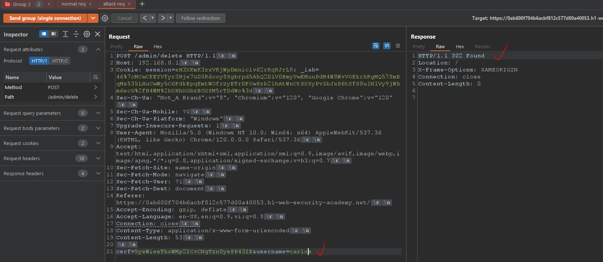

# Host validation bypass via connection state attack
https://portswigger.net/web-security/host-header/exploiting/lab-host-header-host-validation-bypass-via-connection-state-attack

## Phân tích
- Ý tưởng bài này là tận dụng việc reuse HTTP connection để exploit
- Nhận gói `GET /` đổi Host header, nó luôn trả về 301 Moved Permanently

- Ví dụ trên cho ta thấy server luôn xác thực cho request đầu tiên mà server nhận được qua một kết nối mới.
- Ta có thể bypass bằng cách gởi 2 request 1 lúc trong cùng 1 connection, request đầu tiên thì bình thường, nhưng request thứ 2 là tới 1 exploit system
- Tạo 1 normal req

- Attack req 

- Gởi cùng 1 lúc với Group: single-connection, check attack response

- Thêm /admin vào check thử

## Resolve lab
- Làm tương tự như bài trước, chuyển sang POST, thêm csrf và username

- Solved !!
