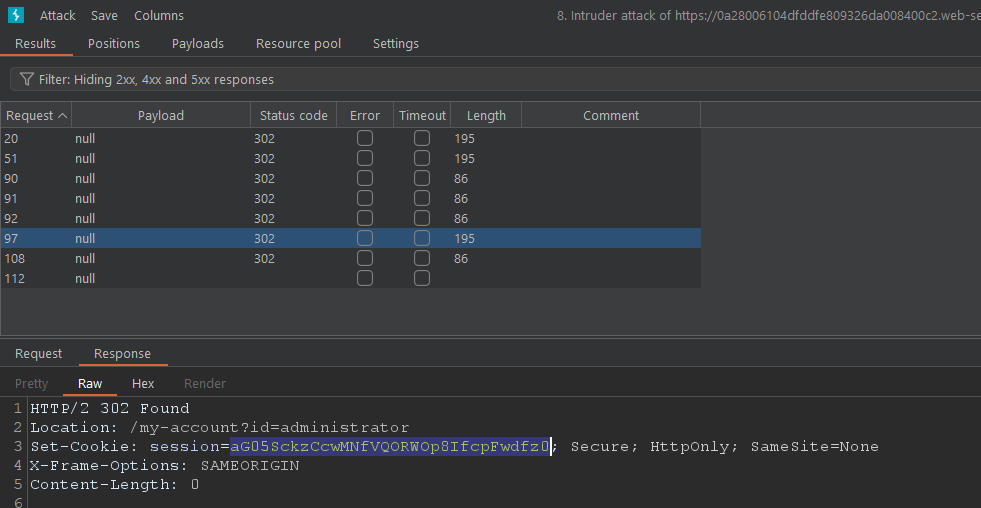

# Response Queue Poisoning via H2.TE request smuggling
https://portswigger.net/web-security/request-smuggling/advanced/response-queue-poisoning/lab-request-smuggling-h2-response-queue-poisoning-via-te-request-smuggling

## Phân tích
- Confirm H2.TE như sau
- Ta thấy HTTP/1.1 ko work với cả CL và TE

- Chuyển qua lại HTTP/2, xóa CL và thêm TE. Vì
  - Nếu FE dùng HTTP/2 và FE dùng HTTP/1.1 để nói chuyện với BE, thì FE sẽ dùng HTTP/2 mechanism để tính CL.
  - Nhưng nếu nó dùng HTTP/1.1 để nói với BE, thì chúng ta mong muốn rằng nó sẽ dùng Transfer-Encoding để rewrite HTTP/2 request to HTTP/1.1 request
  - Và hệ quả là nếu BE chấp nhận Transfer-Encoding thì chúng ta sẽ tạo đc 1 smuggle req
- Attack req

- Normal req

- Note: thỉnh thoảng khi gởi normal req vẫn là 200 OK thì gởi tiếp lại attack-normal (giải thích lab trước)
- Kịch bản lab là dùng H2.TE để đánh cắp cookie của victim (1 session của server giả lập gởi đến) trong gói 302 khi 
- Do đó, ta cần gởi 1 cặp request với 404 response để khi nhận 302 từ victim sẽ dễ nhận biết.

- Attack như sau

## Solve lab

- Gởi attack qua intruder, Null payload : Continue indefinitely , Resource pool là 1, no delay

- Chờ bắt gói 302, và lấy cookie để access path /admin

- Xóa carlos account

