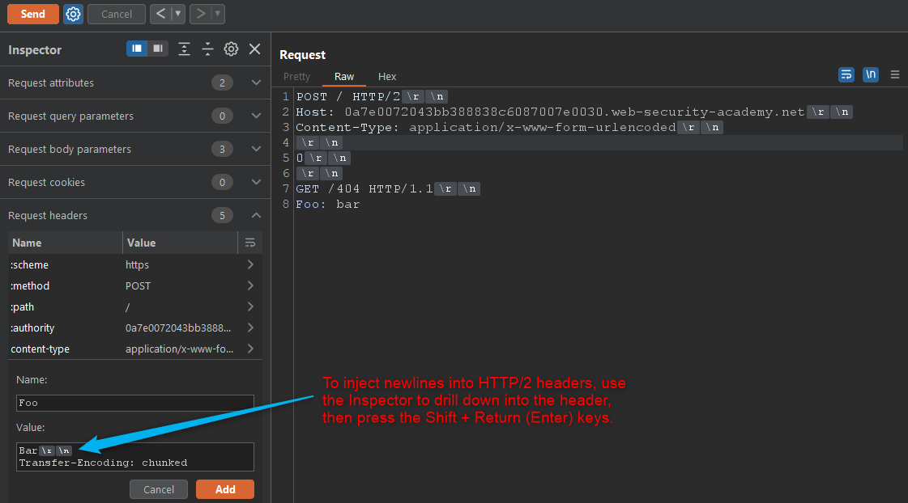
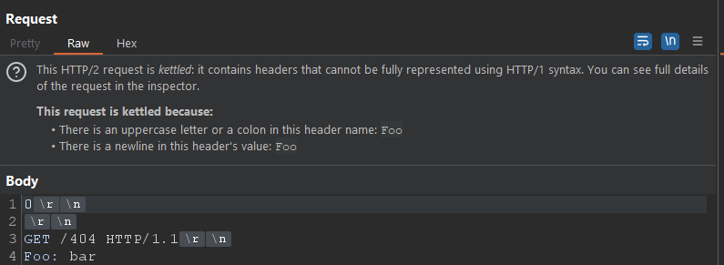
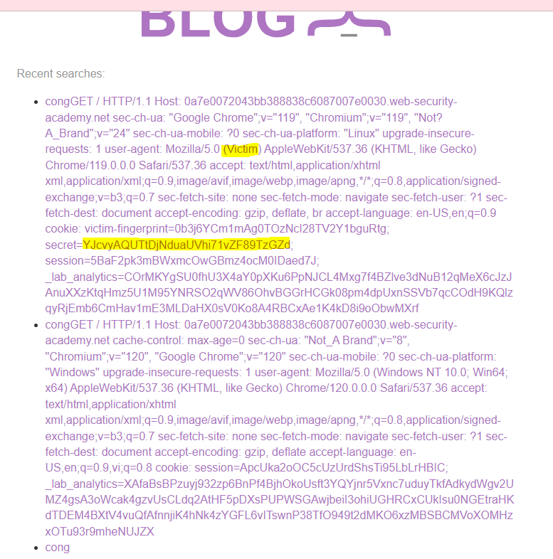

# HTTP/2 request smuggling via CRLF injection
https://portswigger.net/web-security/request-smuggling/advanced/lab-request-smuggling-h2-request-smuggling-via-crlf-injection

## Phân tích
- Phát hiện HTTP/2
  - Capture `GET /`, chuyển qua POST, down xuống HTTP/1.1. xóa CL header, thêm TE: chunked
  
  - Send đi
  
  - Ta thấy rq tự động thêm CL và error báo cả 2 header đều define --> chứng tỏ server force chạy HTTP/2
- Chuyển lại HTTP/2, xóa CL, giữ nguyên TE và chúng ta mong muốn rằng nó sẽ dùng Transfer-Encoding để rewrite HTTP/2 request to HTTP/1.1 request (như lab14)
  - Note: nhớ tắt Update CL trên Burp repeater
  - Attack
  
  - Normal req
  
  - Send cặp này vài lần vẫn là 200 OK thay vì mong muốn là 404 như bài trước
  - Chứng tỏ TE: chunked đã bị xóa bỏ từ FE trước khi đưa xuống BE
  - Ta phải tìm 1 cách khác để inject TE này vào
  - Xóa TE rồi add thêm 1 header như sau. 
    - Cách này chúng ta mong rằng khi FE nhận request này, nó sẽ ko lược bỏ CRLF trong req header, 
    - Mà nó sẽ convert sang HTTP/1.1 để forward CRLF này xuống BE
    - Khi xuống BE, TE header chúng ta inject vào nó sẽ là 1 header mới và BE nó sẽ theo rule của TE
    - Note: sẽ thấy `HTTP/2 req is kettled` -> điều này ko có gì vì ta đã inject vào req header nên burp nó sẽ phải hiễn thị như vậy, cứ send đi thôi

  - Attack
  
  - Normal
  
  - Great ! chúng ta đã inject thành công
- Thử tính năng search, thử search và capture req. chuyển qua HTTP/1.1 xem thử work ko. Ok, work

- Thử đưa req này vào để smuggle, mong muốn sẽ hiện session cookie của victim lên trang search đó.
  - Note: CL 1000 vì ta mong muốn nội dung của request được append nhiều nhất có thể vào req của ta cần.

- Thử refresh homepage, tada, thấy đc cookie nhưng đây chính là cookie của chính máy mình

## Resolve lab
Note: To solve the lab, use an HTTP/2-exclusive request smuggling vector to gain access to another user's account. The victim accesses the home page every 15 seconds.
- Gởi lại attack req, và chờ ~15s

- Dùng cookie này vào web, chính là user của carlos

