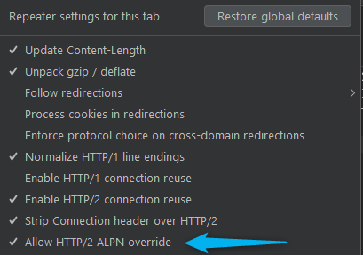
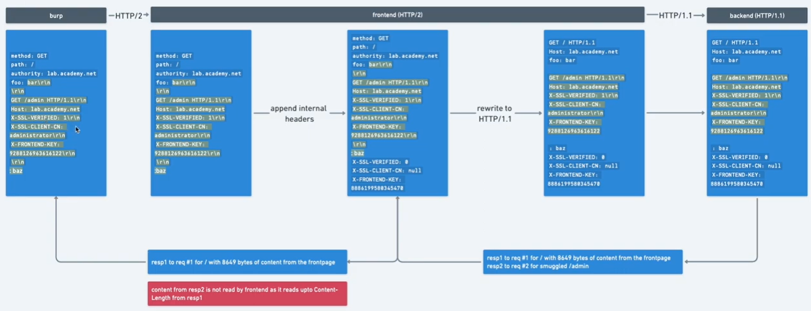
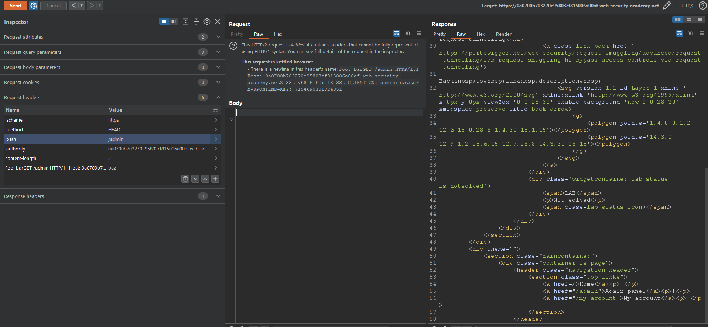
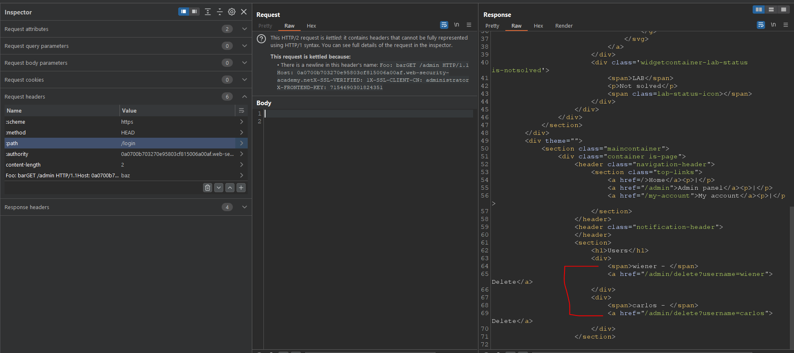

# Bypassing access controls via HTTP/2 request tunnelling
https://portswigger.net/web-security/request-smuggling/advanced/request-tunnelling/lab-request-smuggling-h2-bypass-access-controls-via-request-tunnelling

## Phân tích
- Nhận thấy rằng request ko work với các HTTP/1.1 smuggle thông thường

- Xác định HTTP/2 ở FE.
  - Bật Allow HTTP/2 ALPN override:
    - Giải thích: Enabling this setting allows you to send HTTP/2 requests from Burp Repeater even when the server doesn't advertise HTTP/2 support via ALPN. This lets you explore any "hidden HTTP/2" attack surface reported by Burp Scanner or manually test for hidden HTTP/2 support.
    - Mục đích để chắc chắn là HTTP/2 chạy

  
  - Send
  
- Xác định CRLF cho HTTP/2. Tạo mới 1 header với Host địa chỉ khác

- Ta thấy host abc.com đã đc inject xuống BE, nghĩa là CRLF work
- Tiếp theo, tìm cách Leak các internal headers dùng CRLF injection
  - Dùng diagram sau
  
  - Sử dụng search function, vì nó hiển thị giá trị trả về ngay trên web ui
  
  - Update lại request header để inject 1 search vào
  
  - Tăng giá trị CL lên để xem hết các internal headers
  
  - Now, what do we do with the headers? It would seem these headers indicate certificate authentication is in play. Let’s look at the key/value pairs and see what we can do.
    - X-SSL-VERIFIED: 0 – if ‘0’ means unverified, ‘1’ probably means verified
    - X-SSL-CLIENT-CN: null – if CN stands for Common Name as is typical with certs, we know that we need to login with the administrator account per error message when attempting to access the ‘/admin’ page.
    - X-FRONTEND-KEY: <LONG NUMBER> – not really sure what this one does at this point. Seems unrelated to the certificate auth and is most likely just an identifier the backend uses to ensure it is talking to a trusted frontend.
- Smuggle a request to the admin page
  - Dùng diagram sau
  
  - Cách này là ta lồng 1 smuggle request đến `GET /admin` bên trong 1 normal request là `GET /`
  
  - Thực tế vẫn ko thấy được trang admin vì response nó chưa toàn bộ data của home page (/) rồi.
  - Ta có thể workaround bằng cách thay vì dùng GET, ta dùng HEAD
  
  - HEAD của home page có CL là 8363
  
  - Điều này nghĩa là CL của /admin (sau khi đã authen) nó chỉ 3608, trong CL trong request header là 8363
  - Ta phải thử 1 path khác sao cho CL ~3600 để thấy toàn bộ nội dung của /admin
  - Thử với /admin
  
  
  - Vẫn không thấy được các path cần thiết để xóa user
  - Thử với /login (đối với lab này thì CL: 3247, cũng gần bằng 3600)
  
  - Đã thấy path delete
  
  
  - Send, ta thấy response sau, 500ISE do ko thỏa điều kiện của CL, ko sao, do đây là blind attack nên GET request để xóa user đã thực hiện.
  
  
  - Check lab resolve ok.

