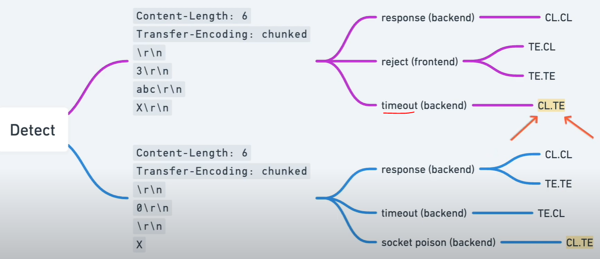
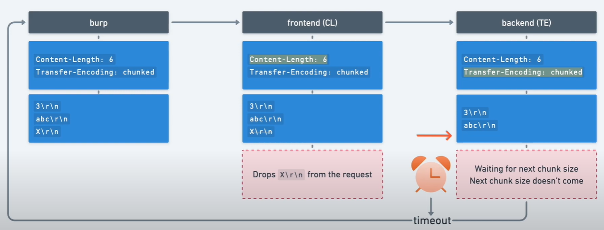
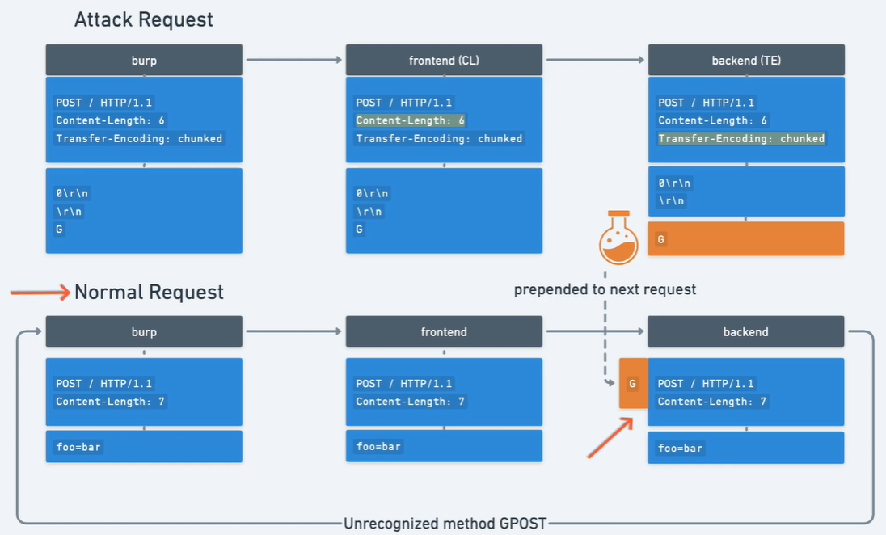
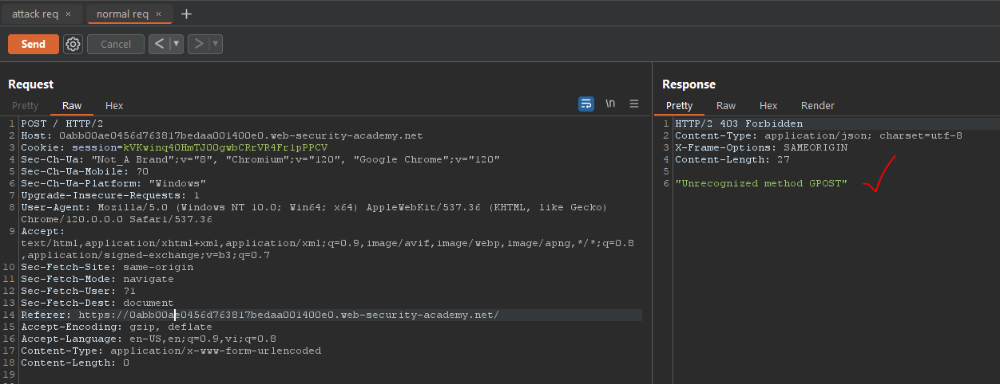

# Lab: HTTP request smuggling, basic CL.TE vulnerability
https://portswigger.net/web-security/request-smuggling/lab-basic-cl-te

Tips để Burp work tốt với chủ đề này


## Phân tích

Sử dụng payload để detect CL.TE (timeout)



- Do FE sử dụng CL là 6, nó chỉ gởi 6 byte gồm 
3\r\n và abc và drop byte X trước khi forward xuống BE.
- Sau đó, BE nhận request, nó sẽ chờ chunked kế tiếp, nhưng nó đã bị drop từ FE nên nó sẽ chờ đến timeout.



## Xác nhận lại CL.TE


- Sử dụng chunk size =0 trong payload như dưới đây để kết thúc của chunked message. (length là 5 bytes)
```
0\r\n
\r\n
```
Add thêm G ngay ở dưới , tổng length là 6 --> request gởi đi vẫn đúng
nhưng do BE nhận message có chunk = 0 nên G sẽ bị cắt đi và nằm chờ để add prefix cho request kế tiếp.



## Resolve lab

- Gởi attack request tương tự

- Gởi tiếp normal req


Done
