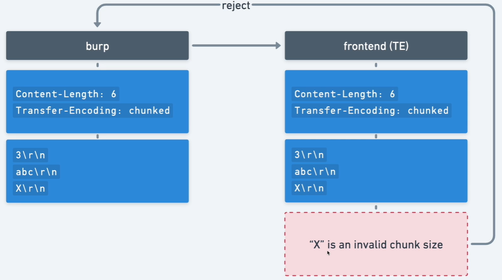
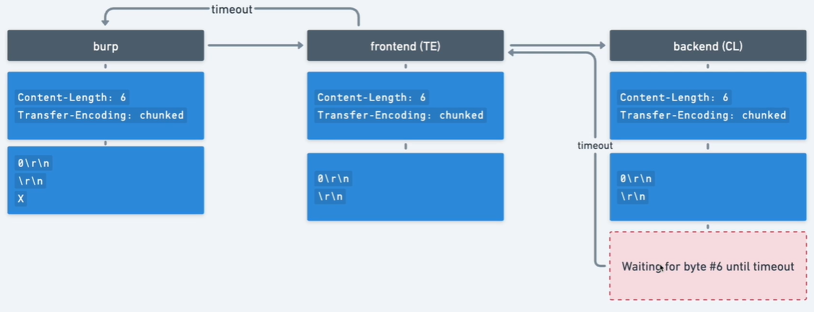
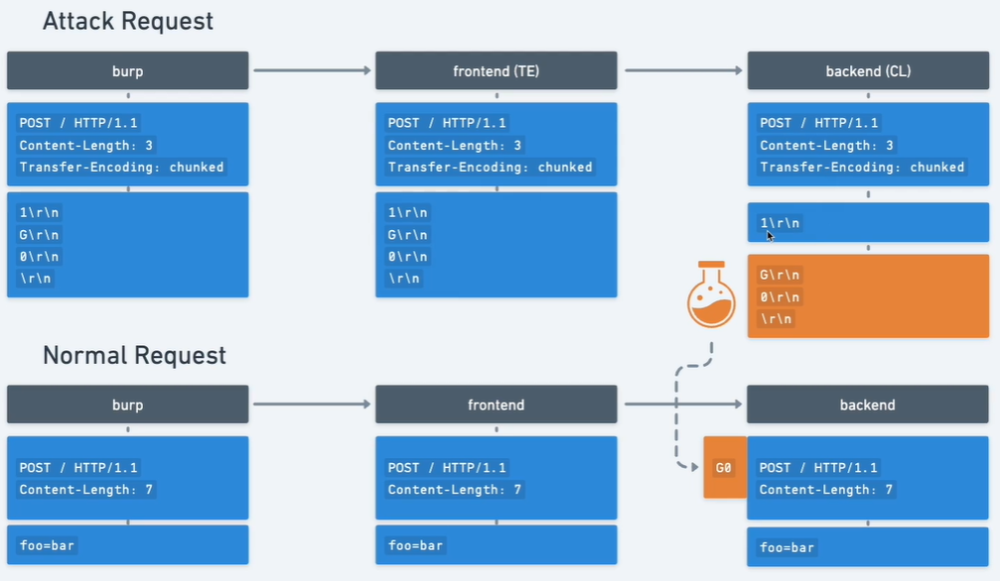
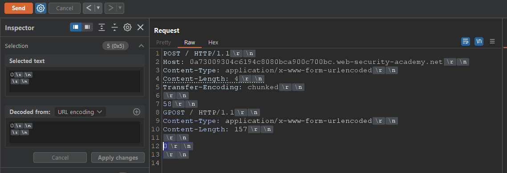

# Lab: HTTP request smuggling, basic TE.CL vulnerability
https://portswigger.net/web-security/request-smuggling/lab-basic-te-cl

## Phân tích

- Xác định method phía FE:
  - X là 1 invalid chunk size, vì mong muốn chunk tiếp theo phải là hexadecimal (xác định số bytes của chunked), nhưng đây là 1 ký tự
  - Vì chunked message ko đúng nên ta xác định đc FE dùng TE
  

**Note:** quay lại lab trước (CL.TE), thì request gởi chunked message sai nhưng FE chỉ verify CL nên request vẫn gởi đi được, và do BE verify TE, mà TE ko đúng nên nó chờ chunked tiếp cho đến timeout. 

- Xác định method phía BE:
  - Do FE dùng TE, sau chunk size = 0 thì nó nghĩ là hết chunked message nên nó forward đến BE (chỉ 5 bytes, drop bytes thứ 6 là X)
  - Và do BE dùng CL để verify (6 bytes) nên nó đợi bytes thứ 6 đến, đợi đến timeout

## Xác nhận lại TE.CL

## Resolve lab

Continue to send a normal request

The lab solution uses Content-Length 6, which works fine as well. It's greater than "actual_content_length + 1", and it's less than "actual_content_length + length of content of our own normal request or a victim's normal request".

- Case with maximum CL: "actual_content_length + length of content of our own normal request or a victim's normal request".

- Normal request với CL = 152

- Attach CL có sẵn 5 , cộng với 152 là 157 ==> Max = 157

- Gởi attack rq xong đến normal rq: WORK

- Nếu max CL = 158 --> timeout, vì BE dùng CL, mà CL là 158 trong khi message có 157, nó đang chờ tiếp 1 byte, chờ đến timeout

