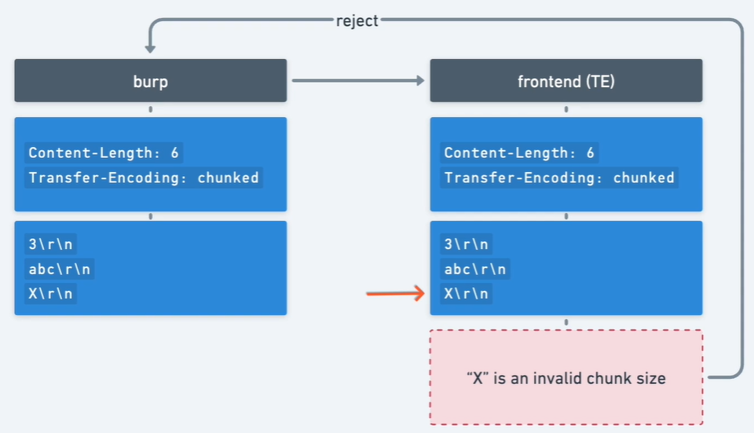
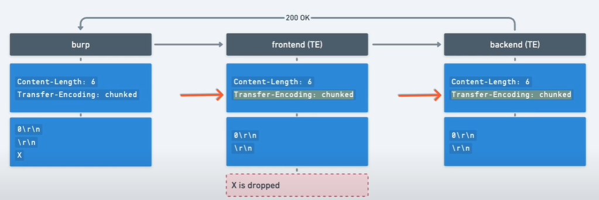
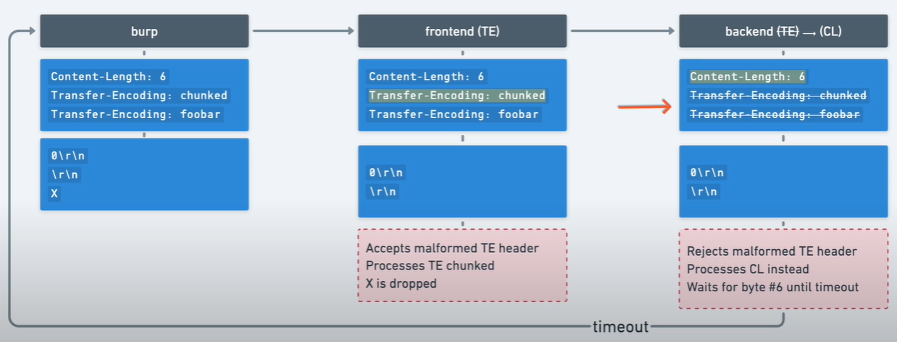
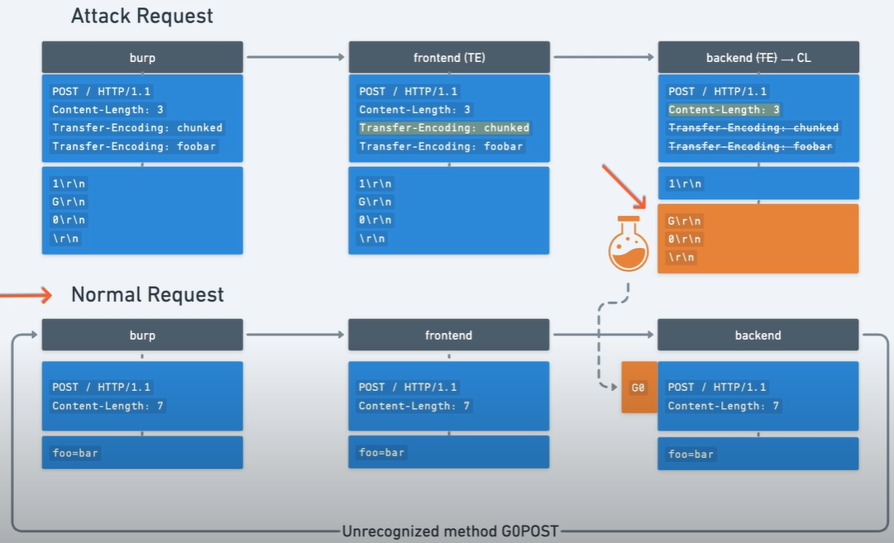

# Lab: HTTP request smuggling, obfuscating the TE header
https://portswigger.net/web-security/request-smuggling/lab-obfuscating-te-header

## Phân tích


- Xác định FE
  - Reject --> FE dùng TE.
  - Ta thấy X là invalid value, expect phải là 1 hex cho chunk size




- Xác định BE
  - Accept: BE dùng TE
  - Ta thấy X bị drop tại FE do FE dùng TE. Request gởi đến BE là valid nên request gởi thành công --> 200 OK




## Phát hiện TE header obfuscation



- Trick : add thêm invalid TE header để BE dùng CL với điều kiện response timeout --> quay về bài TE-CL
```
Transfer-Encoding: xchunked

Transfer-Encoding : chunked

Transfer-Encoding: chunked
Transfer-Encoding: x

Transfer-Encoding:[tab]chunked

[space]Transfer-Encoding: chunked

X: X[\n]Transfer-Encoding: chunked

Transfer-Encoding
: chunked
```


## Xác nhận lại TE header obfuscation



## Resolve lab


