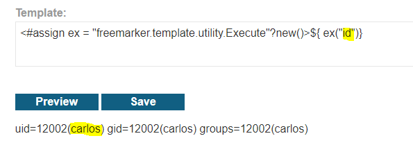

# Server-side template injection using documentation
https://portswigger.net/web-security/server-side-template-injection/exploiting/lab-server-side-template-injection-using-documentation

## Phân tích
- Login vào user đã cho, vào coi sản phẩm và edit template.

- Ta đổi sang 1 biến invalid xem có error gì ko

- Template engine là FreeMarker (Java)
- Vào [Hacktrick](https://book.hacktricks.xyz/pentesting-web/ssti-server-side-template-injection#freemarker-java), search payload cho FreeMarker
- VD: `<#assign ex = "freemarker.template.utility.Execute"?new()>${ ex("id")}`

- Đã execute id cmd


## Resolve lab
- Check ls và rm file

- Done


## Giải thích về command
- Vào Freemarker documentation, và tìm FAQs về `Can I allow users to upload templates and what are the security implications?`, có giới thiệu về `The new built-in`
- Link: https://freemarker.apache.org/docs/app_faq.html#faq_template_uploading_security
- Chú ý : FreeMarker contains a TemplateModel class that can be used to create arbitrary Java objects. 
- Tìm `TemplateModel class`: https://freemarker.apache.org/docs/api/freemarker/template/TemplateModel.html
- Có class `Execute`: https://freemarker.apache.org/docs/api/freemarker/template/utility/Execute.html
- Command: `<#assign ex="freemarker.template.utility.Execute"?new()>`
  - <#assign ...>: This is a FreeMarker directive used for variable assignment. It assigns a value to a variable.
  - ex="freemarker.template.utility.Execute": It assigns the string "freemarker.template.utility.Execute" to a variable named ex. 
  - ?new(): This is a FreeMarker operator used to instantiate a new object. In this case, it's creating a new instance of the object represented by the string "freemarker.template.utility.Execute".

- In FreeMarker, directives are special commands that control the behavior of the template engine. They start with a <# prefix and end with a > suffix. Directives are used to perform various tasks such as conditionals, loops, variable assignments, and more. 
  - Here are some commonly used directives in FreeMarker:
    - `<#list>`: Used for iterating over a list or sequence. It allows you to loop through elements of a list and process them.
    ```
    <#list items as item>
    Item: ${item}
    </#list>
    ```

    - `<#assign>`: Used for variable assignment. It allows you to assign a value to a variable.
    ```
    <#assign username = "John">
    Hello, ${username}!
    ```