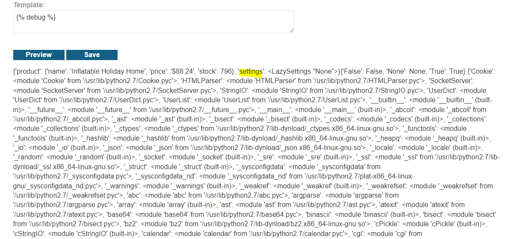
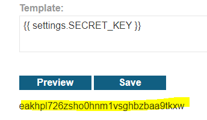

# Server-side template injection with information disclosure via user-supplied objects
https://portswigger.net/web-security/server-side-template-injection/exploiting/lab-server-side-template-injection-with-information-disclosure-via-user-supplied-objects

## Phân tích
- Login with user, vào view 1 sản phẩm, có edit template.
- Gởi burp Intruder, add payload

- Error cho thấy, template engine đang dùng là `Django`
- Thử Search Google với `Django SSTI`, ta thấy trang [PayloadsAllTheThings](https://github.com/swisskyrepo/PayloadsAllTheThings/blob/master/Server%20Side%20Template%20Injection/README.md#django-templates) có nhắc đến `Debug information leak`, đó là ``
- Thử thêm debug này vào.

- Debug log cho thấy danh sách các object và property có thể access từ template. Trong đó có `settings`
- Trong [Django document](https://docs.djangoproject.com/en/5.0/ref/settings/#std-setting-SECRET_KEY), có đề cập `SECRET_KEY` có thể lấy từ `settings`

## Resolve lab
- Update template với `{{ settings.SECRET_KEY }}`

- Submit key này để resolve lab
