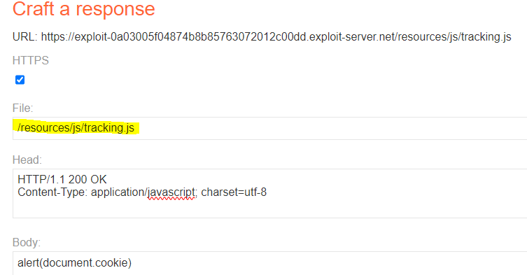

# Web cache poisoning via ambiguous requests
https://portswigger.net/web-security/host-header/exploiting/lab-host-header-web-cache-poisoning-via-ambiguous-requests

## Phân tích
- Giới thiệu về cache buster
  - A cache buster is a technique used in web development to ensure that web browsers fetch and load the latest version of a resource from the server instead of using a cached version. The primary purpose of a cache buster is to prevent browsers from using a locally stored version of a resource, especially when that resource has been modified. 
  - One common method for implementing a cache buster is by adding a query parameter to the resource's URL, typically with a random or changing value. This makes the URL unique for each version of the resource, prompting the browser to fetch the updated version from the server.
  - For example:
    - Before cache buster: http://example.com/style.css
    - After cache buster: http://example.com/style.css?v=123456
- Bắt gói `GET /` , thử thay Host xem có send đc ko

- Ko send đi được, coi lại response của 200 OK, ta thấy 1 số response header là : Cache-Control: max-age=30, Age: 0, X-Cache: miss
- Đây là dấu hiệu của caching (which tell you when you get a cache hit and how old the cached response is)
- Add cache buster để tạo cache mới, ví dụ

- Gởi thêm lần nữa, ta thấy X-Cache: hit, thời gian Age đang tăng lên cho đến 30s, sau đó request sẽ gởi về BE 1 lần nữa để cập nhật lại cache

- Thêm vào đó, thử add thêm 1 Host nữa, xem có gởi được không

- Thấy rằng, Host mới thêm vào được reflect vào javascript path /resources/js/tracking.js
- Ta lợi dụng tính chất này để exploit
- Idea là request với 1 cache buster mới, thay Host qua Exploit server, gởi đến server, khi đó do cache lưu 30s, những access nào đến cache buster này để đẩy qua exploit server, nơi mà đang run 1 javascript file

## Resolve lab
- Hosting 1 js file để alert như sau

- Gởi request một vài lần để thấy X-Cache hit 

- Truy cập trên browser với the same cache buster

- Xóa cache buster trong burp gởi lại, sau đó lên web check

