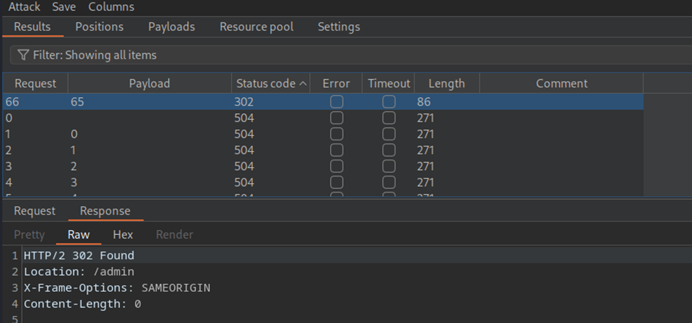
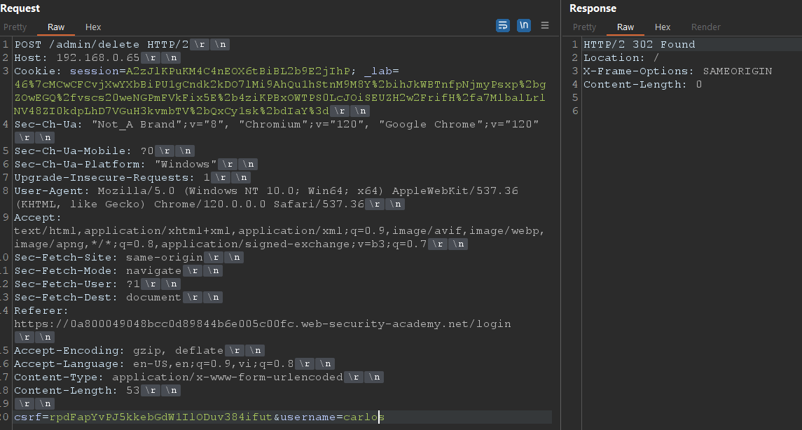

# Routing-based SSRF
https://portswigger.net/web-security/host-header/exploiting/lab-host-header-routing-based-ssrf

## Phân tích
- Gởi `GET /` request vào Repeater, thay Host bằng 1 invalid domain, hay localhost... đều thấy timeout.

- Thử thay Host thành collaborator domain ta thấy đã có request gửi đến collaborator

- Điều này chứng tỏ ta có thể làm cho middleware của web gởi 1 request đến 1 server tùy ý. ==> Có thể bị *SSRF*
- Kế tiếp, ta cần xem thử có tận dụng được lỗi này để truy cập vào internal-only systems. Để làm được điều này, ta cần phải xác định private IP mà đang sử dụng cho website phía internal-system đó
- Có thể dùng cách brute-forcing standard private IP ranges, thường thì range nó sẽ là 192.168.0.x
- Ta gởi GET req đầu tiên vào Intruder, nhớ bỏ tick Update Host header to match target. Wordlist là từ 0-255.

- Kiếm tra response, ta thấy private ip là 192.168.0.65, có path redirect là `/admin`

- Gởi request sang Repeater, check `GET /admin` xem

## Resolve lab
- Change Request method từ GET sang POST request với csrf token và username bên dưới

- Check lab
