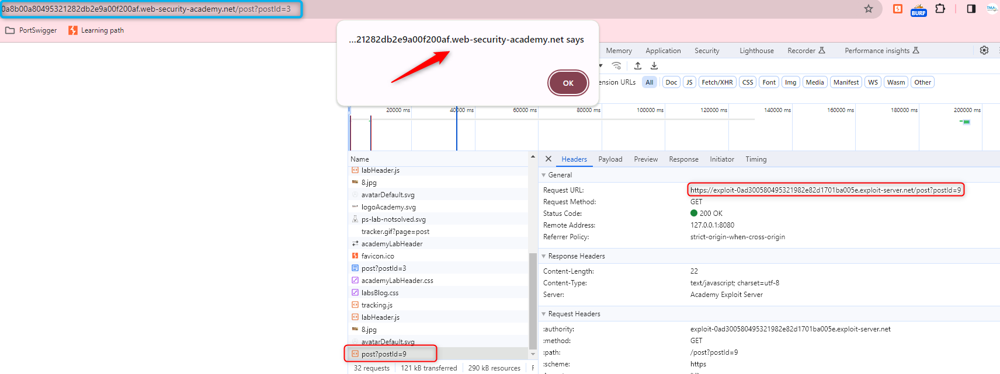

# Exploiting HTTP request smuggling to perform web cache poisoning
https://portswigger.net/web-security/request-smuggling/exploiting/lab-perform-web-cache-poisoning

## Phân Tích
- Detect CL.TE smuggling
- Mở 1 bài post --> Click "Next post"

- Thử lại với 1 host khác --> "Misdirected Request --> do FE check và reject vì nó cần 1 valid host header của BE server để nó forward message đến

- Có thể thử bypass cái này dùng smuggle request
  - Attack req

  - Normal req

  - ==> ta có thể redirect sang 1 host khác, ta dùng host này là 1 exploit server để execute 1 javascript

- Thêm vào đó, ta thấy 1 static asset cached by frontend `/resources/js/tracking.js`

  - Giải thích ngắn: mỗi lần user truy cập 1 bài post, thì sẽ send 1 GET tracking.js và timeout là 30s, hết 30s sẽ revalidate với BE server
  - [Giải thích dài](#a1)
  - Ta gởi 1 smuggle request trước 30s, hết 30s, nó sẽ append smuggle req này rồi gởi xuống BE
  - Do đó bất kì 1 access đến bài post của 1 user nào đó, nó sẽ gởi đến exploit server để execute javascript file.

## Resolve lab
- Phía Exploit server: hosting 1 javascript để alert document.cookie

- Gởi GET `tracking.js` đến khoảng Age: 27 (seconds) thì gởi attack req

- Sau đó gởi GET `tracking.js` --> 302 nghĩa là smuggle đã đc forward xuống BE

- Access to any post on web --> alert xuất hiện

## Giải thích về `Age` & `Cache-Control`

The Age header in the response indicates the time in seconds since the response was generated by a caching proxy server. When you see the Age value increasing, it means that the response is being served from a cache rather than being fetched directly from the server. This is part of the HTTP caching mechanism.

Here's a general explanation of how it works:

- First Request:
  - When you initially make a request, the response is generated by the server and sent back to your browser.
  - If there's a caching proxy server (like a CDN or a caching layer), it might cache the response.
- Subsequent Requests:
  - When you make the same request again, the caching proxy server can serve the cached response instead of forwarding the request to the server.
  - The Age header indicates how long the response has been in the cache.

This is a common mechanism to improve performance and reduce the load on the origin server by serving cached content when possible. The max-age directive in the Cache-Control header specifies how long the response can be considered fresh before it needs to be revalidated with the origin server.

In our case, the response has a max-age=30 in the Cache-Control header, so the cached response is considered fresh for 30 seconds. If you make the same request within that time frame, the caching proxy will serve the cached response, and the Age header will keep increasing until it reaches the maximum allowed age. After that, the proxy will need to revalidate the content with the origin server.