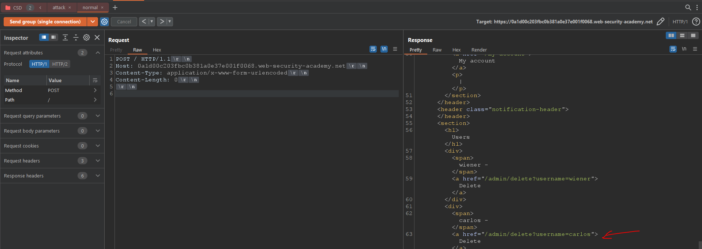

# CL.0 request smuggling
https://portswigger.net/web-security/request-smuggling/browser/cl-0/lab-cl-0-request-smuggling

# Phân tích
- Giải thích cho CL.0
  
  - Xuất hiện trong HTTP/1.1
  - FE dùng CL để verify còn BE nó sẽ ignore CL (CL=0)
- Để phát hiện Client side desync, có thể dùng 3 cách

  - Trong bài này ta dùng POST request tới 1 static file
- Lưu ý với burp khi làm bài này

  - Thêm header `Connection: Keep-Alive` vào request
  - Nhưng do burp ignore header này đi, nên ta phải `Enable HTTP/1.1 Connection Re-use`
- Gởi group request (attack + normal req)

- Ở normal req, expect là nhận 200 OK, nhưng thực tế là 404 do smuggle trong attack req --> CL.0

## Resolve lab
- Dùng CL.0 để bypass admin page

- Sửa lại attack req trong group trên

- Send đi, check response trong normal req

- Update lại attack req để xóa user, thấy 302 response trong normal req

- Refresh lại homepage để check resolve lab
