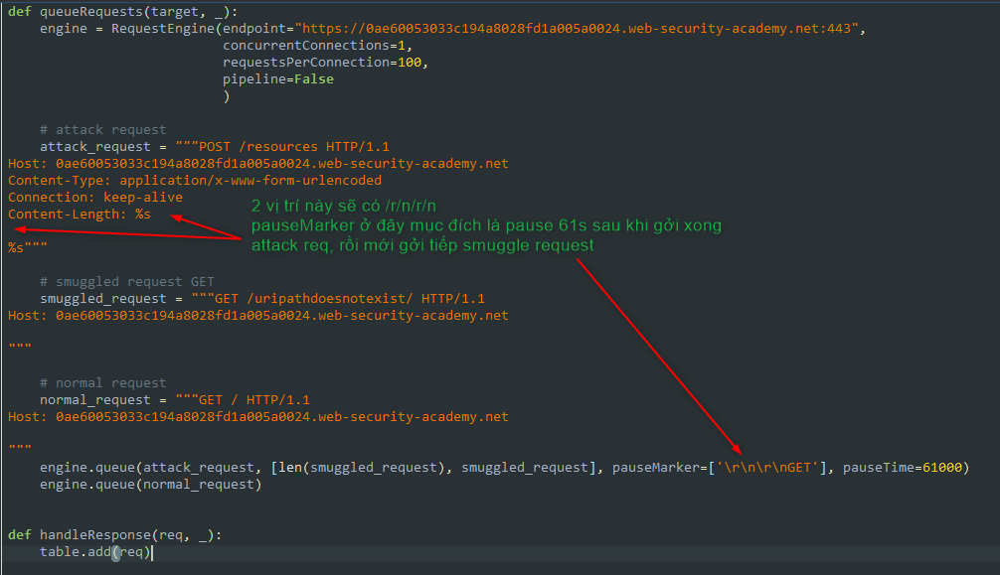
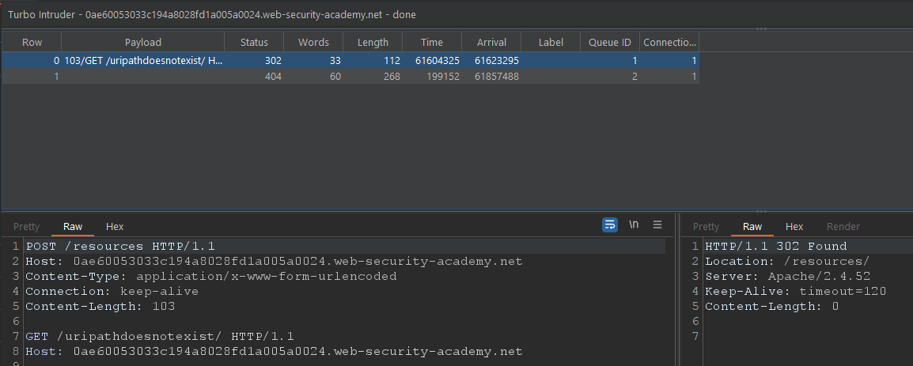
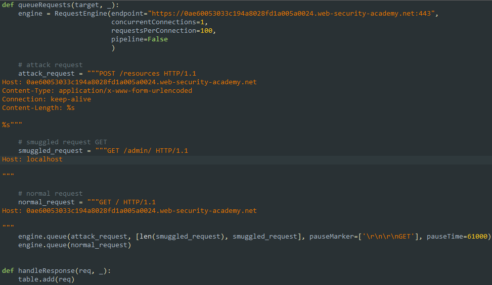
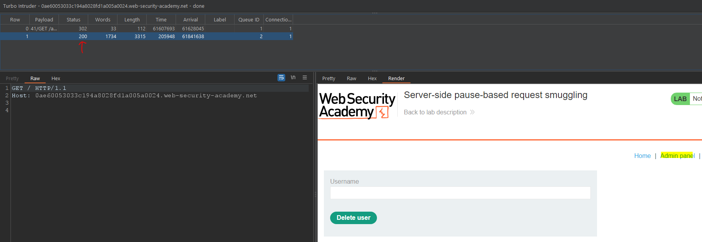
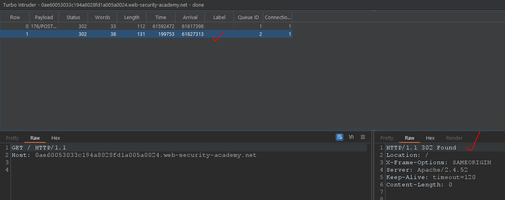

# Server-side pause-based request smuggling
https://portswigger.net/web-security/request-smuggling/browser/pause-based-desync/lab-server-side-pause-based-request-smuggling

## Phân tích
- Bài toán đặt ra là khi server nó timeout request nhưng vẫn giữ open connection, do đó ta có thể construct server-side request smuggling exploits for websites   
- Ta gởi 1 attack request gồm 1 request đúng, pause 61s rồi lồng vào 1 smuggle request (e.g: tới source /404)
- Sau đó gởi tiếp 1 normal request, expect là sẽ response 404 Not found trong normal req response.
- Find endpoint with server level redirect:
  - Ta thấy 1 số static file
  
  - Gởi vào repeater, chuyển qua post với HTTP/1.1 và xóa file path như sau, ta thấy 302 vẫn trả về nghĩa là endpoint này work với redirect
  
- Detect & Confirm CL.0 vulnerability through Differential Responses
  - Đẩy gói này qua Intruder, tạo 1 script (Script1.py) để gởi cả attack (request to source + pause 61s + smuggle req) và normal request
  
  - Coi response
  
  - Ta thấy ở normal request nhận response là 404 đúng như expected --> CL.0 pause-based request smuggling vulnerability.
  
- Smuggle in a request to the admin panel.
  - Ta thấy path /admin bị block
  
  - Sửa smuggle để `GET /admin/` trong Intruder rồi attack
  
  - Hm, bị báo 401, ta chuyển Host của smuggle request về localhost xem (mục đích chuyển là vì nó cần 1 local user để login)
  
  - Attack, ta thấy sau 61s thì có response 200 OK, nghĩa là access đc admin page
  
  - Để ý là để xóa user, yêu cầu phải là POST request to /admin/delete, 1 username và 1 csrf.
  - Ngoài ra còn có session cookie `Set-Cookie: session=fysOrJlUg3yB0ysnn48lk5bBv7zazj34`
  - Và `name="csrf" value="DJpsiHGuJBYEHxKaAsfOFluJkICjZXUk"`

## Resolve lab
- Dùng Script 2 để run Intruder, check response

- Ta thấy 302 ở request thứ 2 nghĩa là user đã xóa thành công

