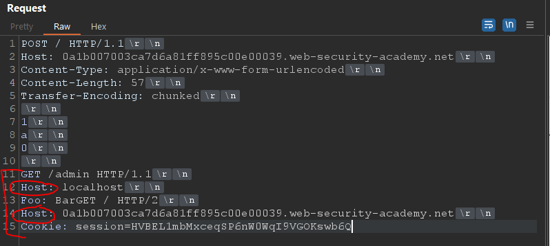
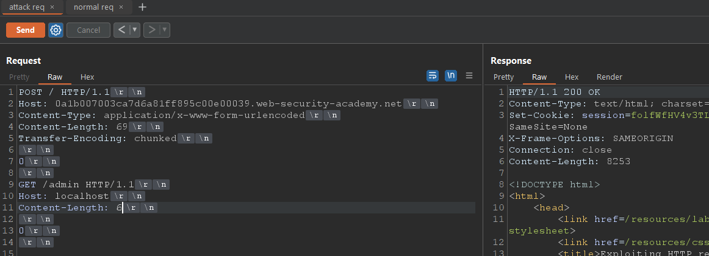

# Exploiting HTTP request smuggling to bypass front-end security controls, CL.TE vulnerability
https://portswigger.net/web-security/request-smuggling/exploiting/lab-bypass-front-end-controls-cl-te

## Phân tích
- Dùng kĩ thuật ở lab1 để detect CL.TE
- Để ý rằng path /admin bị block

- Smuggle path /admin dùng CL.TE (note: ko có `/r/n` sau header Foo để request sau append vào req này)

- Gởi tiếp 1 normal request

- Thấy "Admin interface only available to local users" ==> Dùng kĩ thuật Trick cho BE nghĩ rằng là chúng ta đang là local user bằng cách để Host header là `localhost`

Attack req

Normal req: "Duplicate header names are not allowed"

Bởi vì có 2 Host header chung 1 request sau khi exploit req gộp với normal request

## Solve lab

- Attack req

- Normal req -> thấy path /admin/delete?username=carlos

- Thử tiếp với path để delete carlos

Done
