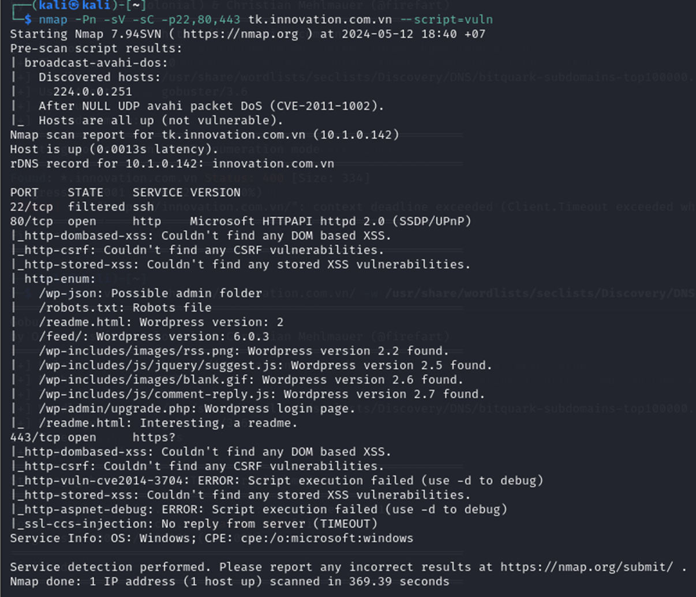
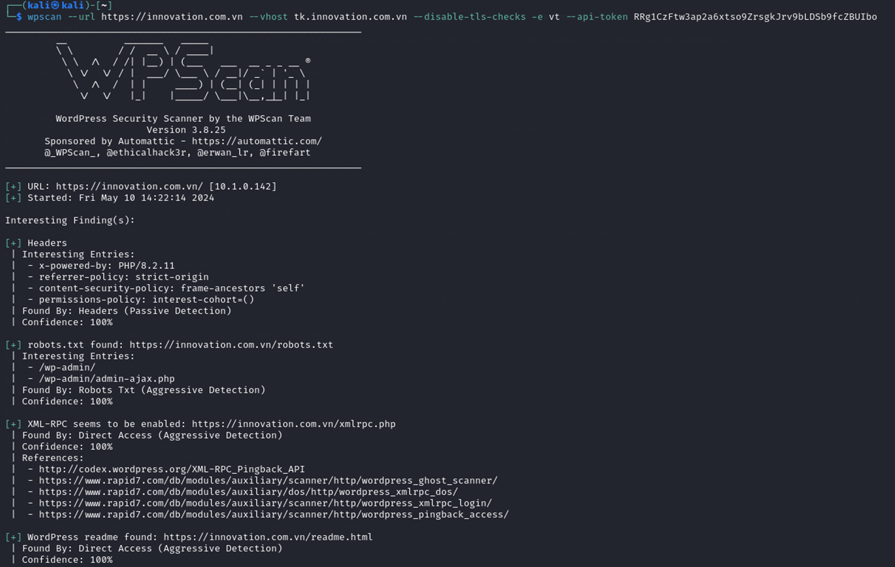
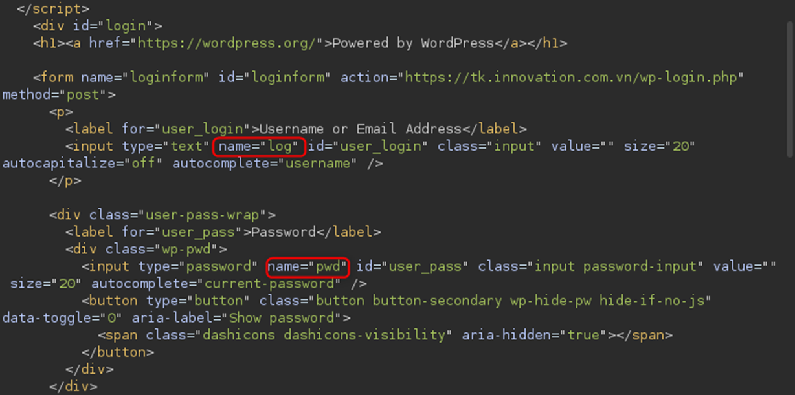
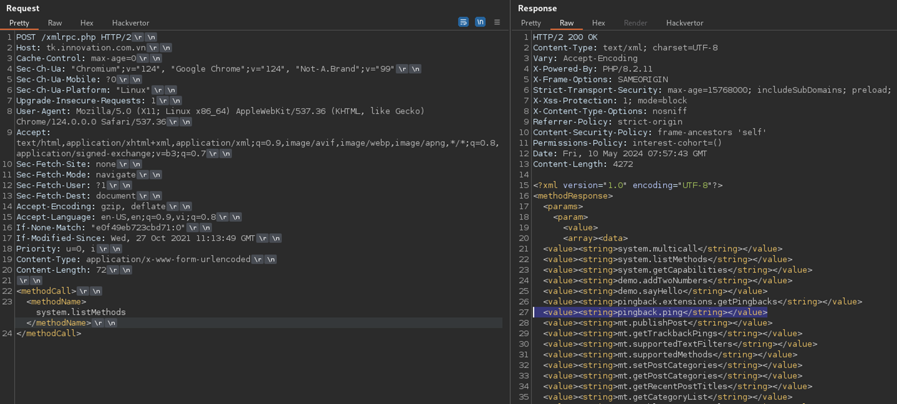
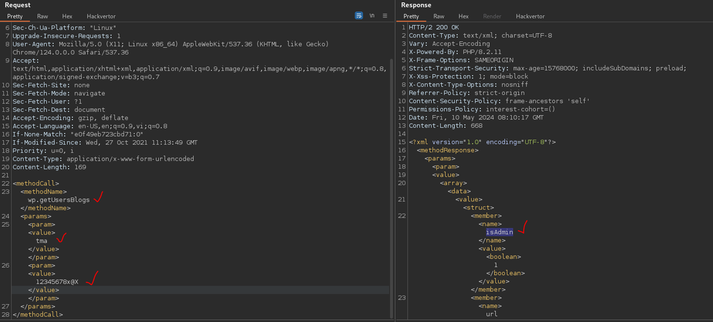

- During my practicing some study cases, I found out the vulnerability’s issues related to our innovation.com.vn domain.
- The exploitation idea is based on Creative lab from tryhackme website. The write-up for my reference is https://medium.com/@niedhacker/creative-tryhackme-44a65eaee5d5

- Issues:
  - Vulnerbility 01: Wordpress username and password can be brute-forced. 
  - Vulnerbility 02: Wordpress xmlrpc.php vulnerabilities

- Now let’s go to see the PoC in each day:

## Day 01 (May 08): first idea starting and enumeration. 
-	Read https://medium.com/@niedhacker/creative-tryhackme-44a65eaee5d5 and practice on real lab – Yes, I already finished it. (just follow steps)
-	Think about https://sgas.innovation.com.vn/ web. Can it be applied to gain access? – Trying…
-	Check nmap port scan.

-	Try with vhost or sub-domain:

-	Nothing interesting. Think that it might not have any vhost/subdomain in sgas.innovation.com.vn. Let’s try with TLD innovation.com.vn

-	Hm, we can see tk subdomain (tk.innovation.com.vn), can we get any interesting thing here? Run nmap again!!

-	We can see too many interesting things here. Use the chrome to see if we can access on web port (80/443)

-	No, we cannot. Try with Burp

-	Well, we get 200 OK. Let follow above article to enumerate localhost port (run in Intruder and add port as a variable with Payload is number from 0 to 65535.
-	Note that this step is taking a long time to enumerate.

-	Finally, after a couple hours, it finished but nothing changes in Response.

-	Seems that this enumeration does not work. It’s not a lucky day. ☹
-	Some useful harvested information:
     - A hidden tk vhost in innovation.com.vn
     - Port 80, 443 opened, they could be contained some vulnerabilities.
-	End day 01.

## Day 02 (May 9): WPScan and brute-force wordpress username/password

-	Scan nmap for this domain. We can see port 80 has Wordpress service is running.

-	Leverage WPScan to find more information. I refer to https://medium.com/@niedhacker/tryhack3m-bricks-heist-2024-592e203d2536

-	In the namp result, I see install.php file has a login page (wp-login.php)

-	Try to access with wp-login.php

-	I see a login form, investigate the form, I see that it needs log & pwd to login (it could be a username and password respectively). And it requires a POST method!!

-	Try with any username and password  not a valid one

-	Can we enumerate the username? Yes, WPScan supports scan this (use --enumerate u). Result is:

-	Great. It finds a tma user with its posts.

### Vulnerability 01: Enumerate user/pass of Wordpress successfully

-	Try to brute-force password with Intruder by wordlists. Failed as no password is accepted.

-	Let’s try with magic TMA password (12345678x@X). And interesting, I can login successfully 😊

-	End day 02.

## Day 03 (May 10): 
### Vulnerability 02: Wordpress xmlrpc.php vulnerabilities
-	In WPScan from day 02, I notice that xmlrpc.php is exposed.

-	Follow some tips to find xmlrpc.php vulnerabilities: https://ms-official5878.medium.com/xml-rpc-php-wordpress-vulnerabilities-9a7d66068bde
-	Try with system.listMethods.

-	To perform XSPA or Port Scanning we need to check what are the methods are supported by XML-RPC and mainly “pingback.ping” is the one which is abused by attacker to launch XSPA or DDOS attacks. As we know “pingback.ping” is enabled on XML-RPC server, then let’s proceed and try and get a ping back on our server, we can use netcat , or python server , nodejs server , or even the apache logs anything we want. I’ll be using the webhook http-server as it needs to be reached from the internet.

-	Start server and send the following request in post data

-	Check log on server. We can see the log, this mean that our external server get a pingback message from server by using xmlprc.php.

-	Additionally, we can use user/pass from day-02 to login by  wp.getUserBlogs method.

-	For the mitigation, we can follow https://www.rosehosting.com/blog/what-is-wordpress-xml-rpc-and-how-to-stop-an-attack/
     - Disable Pingbacks
     - Prevent All Authentication Requests via XML-RPC
     - Disable Access to xmlrpc.php

