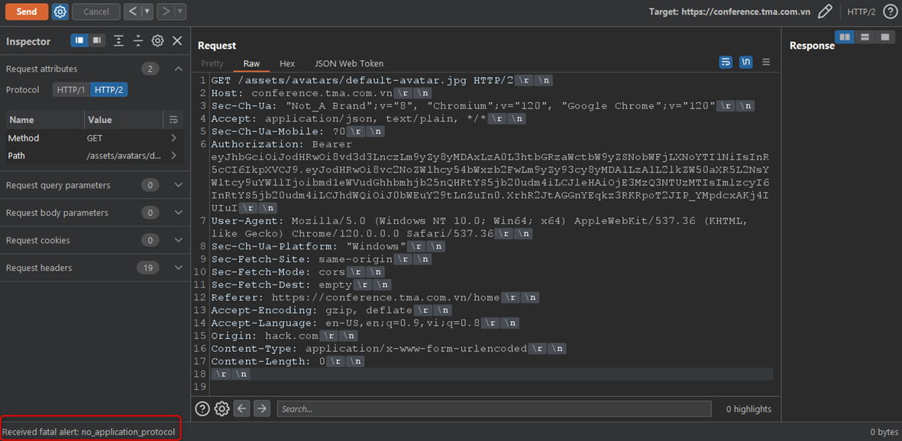
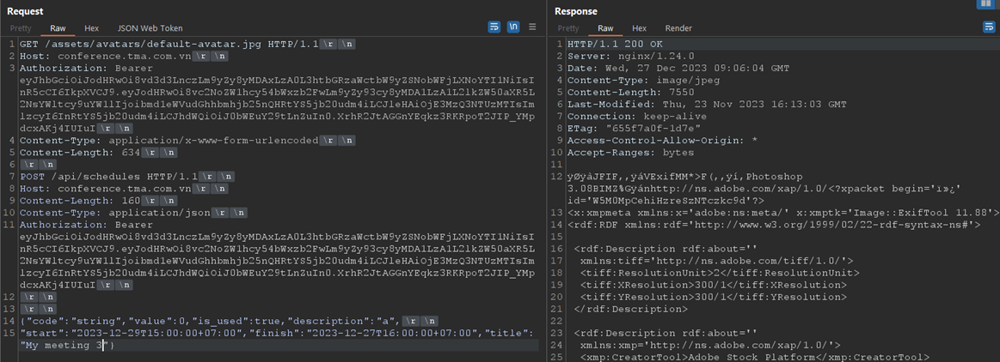
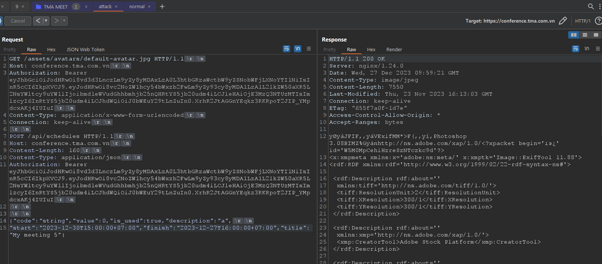
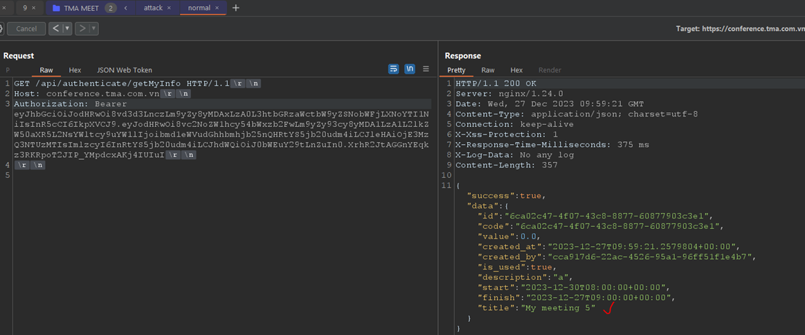
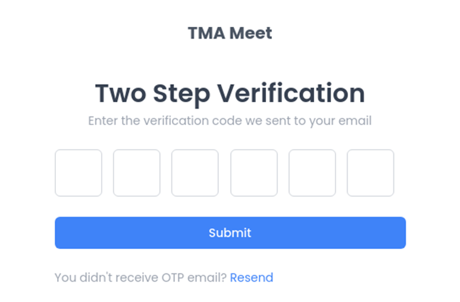
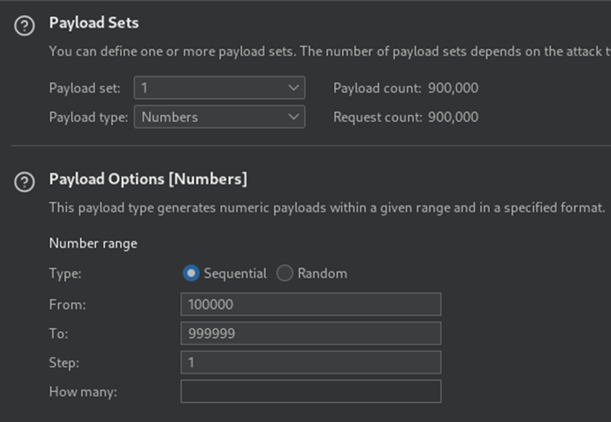
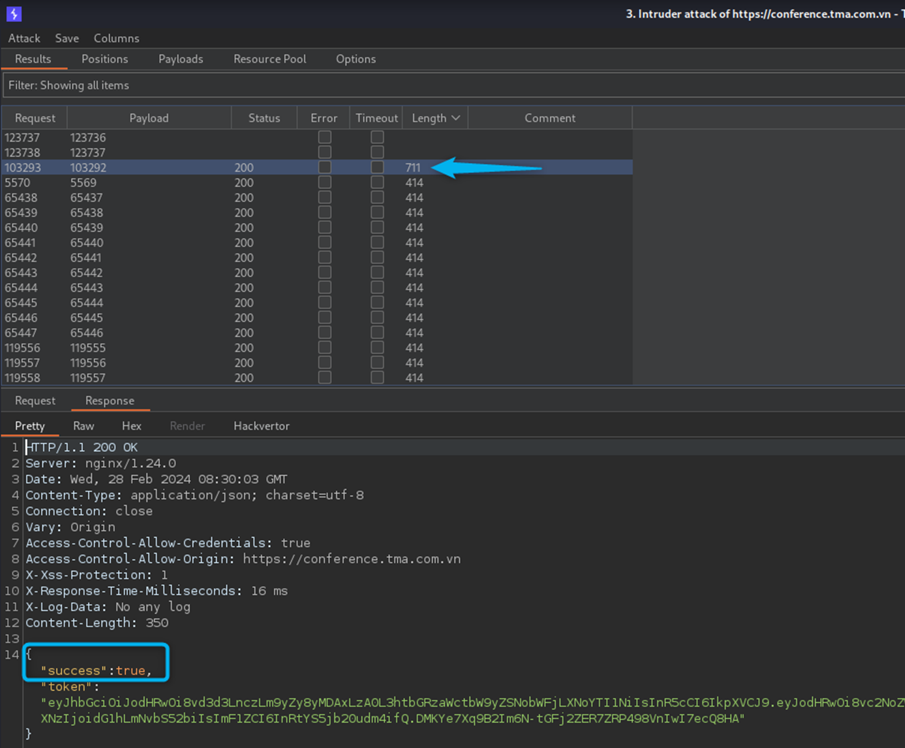

## Issue 1: HTTP request smuggling (Client Side Desync Attack - CL.0)
### 1.1 - A short explanation:

### 1.2 - Confirm HTTP/2 does not work, HTTP request just works with HTTP/1.1 only
- Upgrade request to HTTP/2 in Burp
- Enable ‘Allow HTTP/2 ALPN override’
- Send the request
- We receive an error “no_application_protocol”

### 1.3 - Confirm CL.0 vulnerability

•	Capture 2 requests below and send to Repeater

•	Combine them into 1 request then send. Make sure it is sent successfully. Rename this request in tab repeater with ‘attack’

•	Capture a normal request and send to repeater. Named it with ‘normal’ tab

•	Group these 2 tabs and then send with Group option (single connection). Check responses.

•	Check response in normal request. We can see that, although the request is to getMyinfo, but response is to confirm a new meeting is scheduled.

### 1.4 - Exploit the vulnerability to delete the victim meeting without victim’s token

•	For some reason, I know meeting url from the victim (we might see it via email request)
•	In this case, I create another user and schedule new meeting.
•	E.g: https://conference.tma.com.vn/live/177cc7a5-2c6d-4938-9271-5476c6d302fb

•	Update ‘attack’ request to smuggle DELETE API with id 177cc7a5-2c6d-4938-9271-5476c6d302fb

•	Check normal request response. Well, we have deleted it successfully.

•	Check on web UI. It was deleted.

Conclusion: it is quite important as an attacker can use this vulnerability to bypass front-end security control or deliver a RCE or XSS attack. 

## Issue 2: OTP code Brute-forcing 
Proof of concept:

Description: TMA Meet is currently just allowing TMA email to register as a new user. But now I can register with invalid TMA email and brute-force the OTP code to bypass Two Step verification.

Steps:
1/ Sign up an invalid email

2/ Next window for Two Step Verification displays to enter OTP code sent via email.

3/ Of course, this email is invalid so we won’t see the email with OTP. Let’s enter any 6-digit number to intercept this request via Burp Suite.
Continue to send it to Intruder and do the brute-force attack.

As it is a 6-digit number, so the payload will be:

4/ Run the attack and observe the result. You can see we can get 200 OK, “success”:true, with OTP 103293

5/ We can login with this invalid email to TMA Meet.

With this issue, I think it is quite critical and we should fix it soon.
For solution how to prevent it, we might have a discussion on this as I have some limited knowledge on preventing.