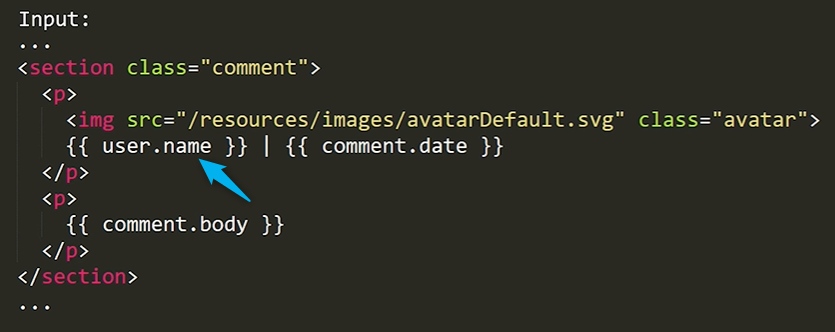
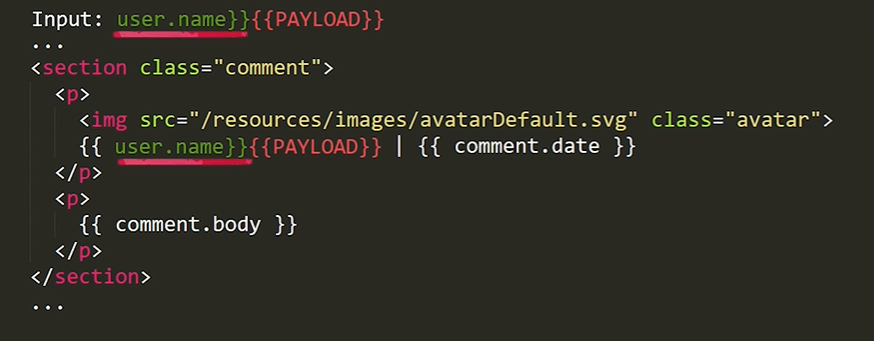

# Basic server-side template injection (code context)
https://portswigger.net/web-security/server-side-template-injection/exploiting/lab-server-side-template-injection-basic-code-context

## Phân tích
- Login default user (wiener)
- Dạo qua các function như 
  - View post/post comment 
    - Using Hacktricks to Fuzz Comments --> _Failed_ vì ta thử các payload nhưng nó ko valuated
    
    - Ta thấy tên của người dùng đc reflect trong các post.
  - Update *Preferred name*
  
    - Để ý thấy `blog-post-author-display` sẽ hiển thị theo user.name, user.first_name, or user.nickname
- Để detect SSTI, ngoài dùng các payload có sẵn, ta có thể dùng error message để xác định template engine đang sử dụng
- Gởi req với invalid name và refresh bài post trên browser

  - Note: ta thấy error message trên bài post vì do nó đang xài template có object là user và attribute là name, ở đây attribute bị sai nên ko hiển thị lên được --> báo error ngay trên post web UI.
- Ta xác định đc template engine đang dùng là `Tornado`, syntax là `{{someExpression}}` --> dùng các payload trong [Hacktrick](https://book.hacktricks.xyz/pentesting-web/ssti-server-side-template-injection#tornado-python) của Tornado để exploit
- Ví dụ `{{os.system('whoami')}}`

- Lỗi syntax

- Vì syntax của Tornado phải là `{{someExpression}}`, trong khi ở đây bắt đầu bằng ` ...`
- Hãy tưởng tượng underlying code của UI sẽ là

- Nếu là chèn thêm payload để exploit thì phải thêm `}}` để close-off cái user.name object lại 

- Do đó input sẽ phải là `user.name }}{{ PAYLOAD to exploit }}`

- Kết quả là đã exploit được user

- Ta thấy whoami là carlos, check tiếp `pwd` và `ls` cmd

## Resolve lab
- Tiến hành xóa file morale.txt

- Done!!
