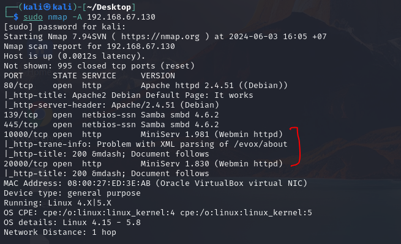
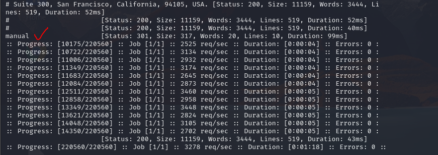
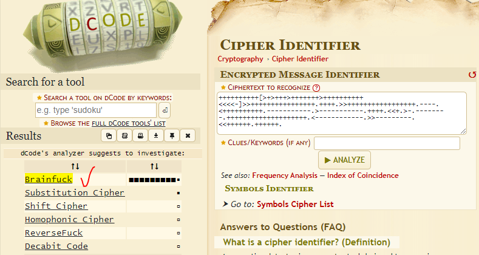
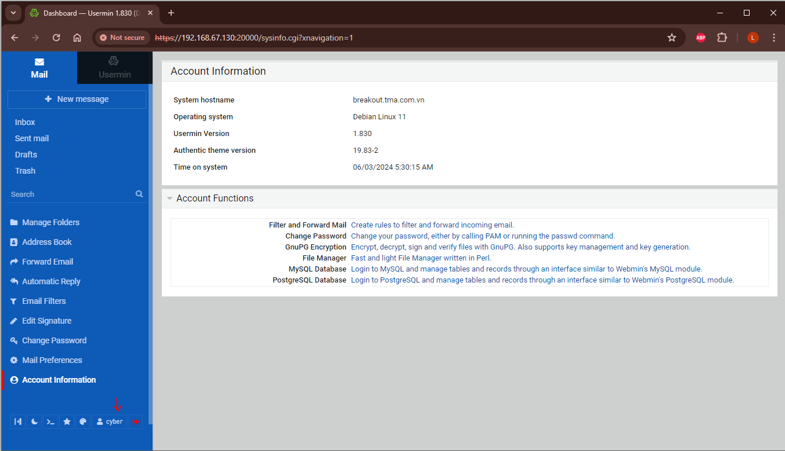
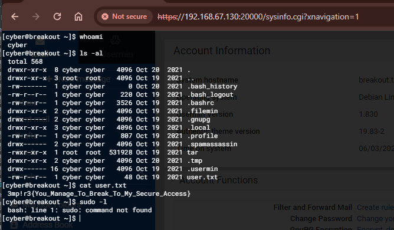
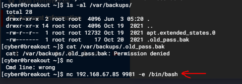
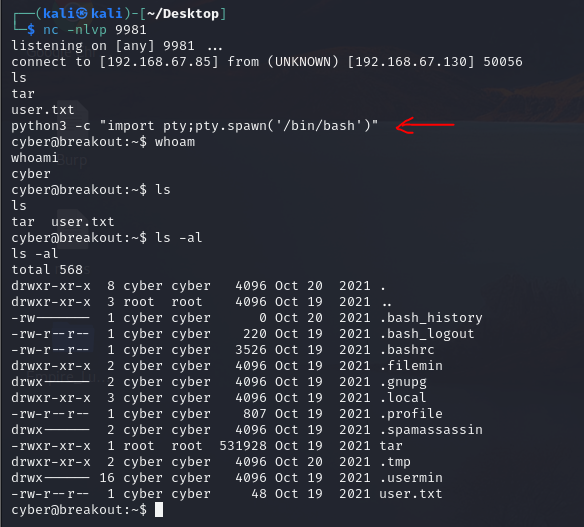
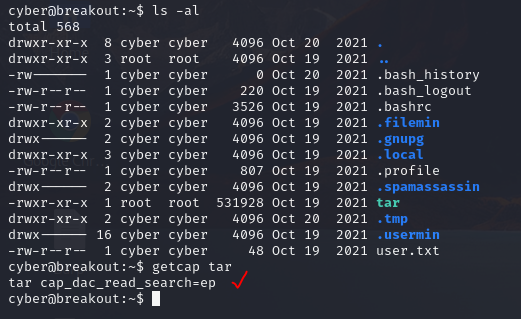
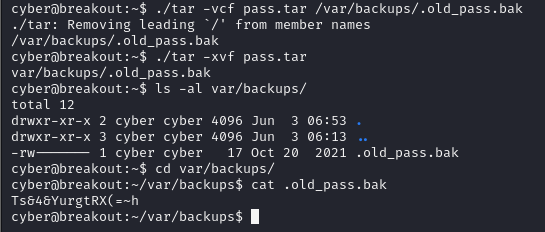

# *Empire: Breakout* - Vuln Hub lab practice
- VM URL: https://www.vulnhub.com/entry/empire-breakout,751/
- Download và giải nén, import ova file vào VirtualBox để tạo máy ảo

- Note: IP sẽ được tạo tự động, ở đây là `192.168.67.130`
- Dùng nmap scan (-A)

- Ta thấy có các lưu ý:
  - Port 80/http default page cho Apache2 Debian
  - Port 139, 445 for samba on linux (có thể dùng enum4linux tool để scan SMB)
  - Port 10000, 20000 cho web admin
- Đầu tiên, ta access port 80 xem

- Dùng fuff để tìm hidden folder `ffuf -w /usr/share/wordlists/dirbuster/directory-list-2.3-medium.txt -u http://192.168.67.130/FUZZ -mc 200,301 -t 200`

- Có /manual với 301 response, check thử thì nó redirect tới Apache doc, cũng ko có gì đặc biệt

- Quay lại trang chính (port 80), check source code ta thấy 1 đoạn note đã đc mã hóa `++++++++++[>+>+++>+++++++>++++++++++<<<<-]>>++++++++++++++++.++++.>>+++++++++++++++++.----.<++++++++++.-----------.>-----------.++++.<<+.>-.--------.++++++++++++++++++++.<------------.>>---------.<<++++++.++++++.`

- Dùng https://www.dcode.fr/cipher-identifier để check xem nó đc encrypt bởi programmation language nào.

- Đó chính là `BrainFuck`, hãy giải mã nó, pass là `.2uqPEfj3D<P'a-3`

- Cần phải tìm 1 user để login, vì có SMB port, dùng enum4linux để check xem có gì interesting.


- Ta thấy user là `cyber`
- Thử login vào webadmin ở port 10000, và 20000, thì thấy chỉ webadmin ở port 20000 là login đc với user/pass ở trên

- Trong admin panel, có 1 menu là Command Shell, gõ 1 số lệnh, chú ý sudo -l fail.

- Ta tạo 1 reverse shell để máy attacker (Kali) có thể run command trên máy victim

- Ở máy Kali, dùng nc cmd để listen

- Lưu ý dùng kĩ thuật upgrade shell để full control, kĩ thuật này có mention trong `CompTIA PenTest_ Certification All-in-One Exam Guide, Second Edition (Exam PT0-002)` doc trang 534.

- Note: `Using these commands, a penetration tester can transform a basic reverse shell into a more usable and robust interface, facilitating more efficient interaction with the compromised system.`
```
export TERM=xterm
python3 -c "import pty;pty.spawn('/bin/bash')"
(press CTRL+Z)
stty raw -echo;fg;reset

Explain:
1. Set Terminal Type: Ensures compatibility with terminal features.
2. Upgrade to a TTY Shell: Makes the shell interactive using Python.
3. Suspend the Shell: Temporarily pauses the shell to adjust settings.
4. Configure Terminal: Adjusts terminal settings for better interaction and brings the shell back.
5. Reset Terminal: Clears any display issues and sets up a clean environment.
```

- Ta ko đọc đc file .old_pass.bak vì ko có permission 

- Để ý ở home có file tar, getcap file này - `CAP_DAC_READ_SEARCH` - It means that it can read all the files on the system irrespective of their permissions. 

- Dùng tar này để tạo và giải nén file (lưu ý: khi giải nén file rar, sẽ giải nén ra `var/backup`, trong khi `/var/backup` là folder chưa file bak mà ta ko có quyền đọc)

- Lấy dc pass root, su root thôi

- Done vì đã escalate lên root user thành công.