# *Empire: LupinOne* - Vuln Hub lab practice
- VM URL: https://www.vulnhub.com/entry/empire-lupinone,750/
- Download và giải nén, import vào VMWare để tạo máy ảo

- Note: IP sẽ được tạo tự động, ở đây là `192.168.67.131`

## Tiến hành recon và exploit:

- Scan nmap để tìm hết các port đang mở
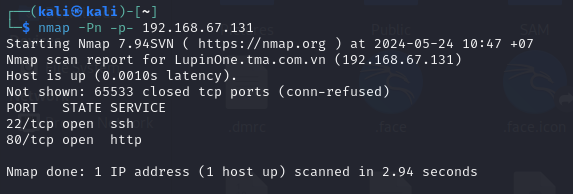
- Ta thấy có port 22, 80, tiếp tục scan 2 ports này
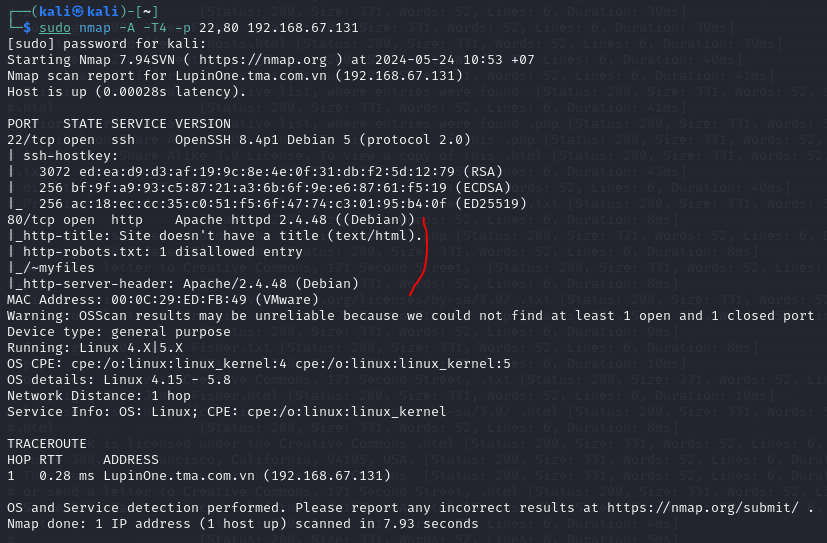
- Access web port 80 --> nothing

- Ta thấy có file robots.txt với `Disallow: /~myfiles`  --> Error 404

- Dùng kĩ thuật fuzz để tìm các hidden folder --> ko thấy gì đặc biệt
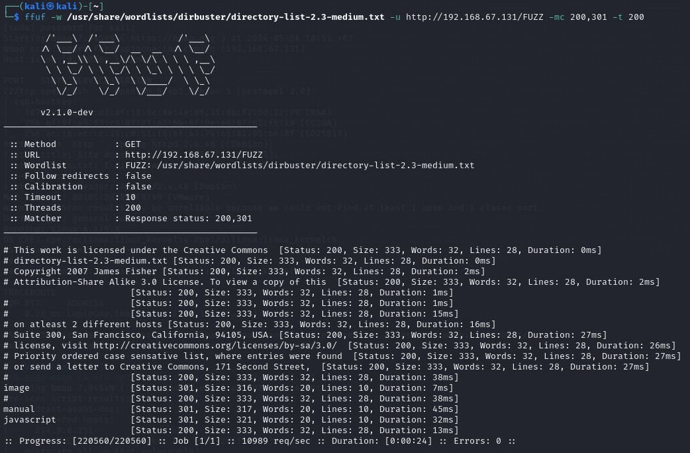
- Để ý dấu `~` trong myfiles, ta fuzz với ~ prefix này
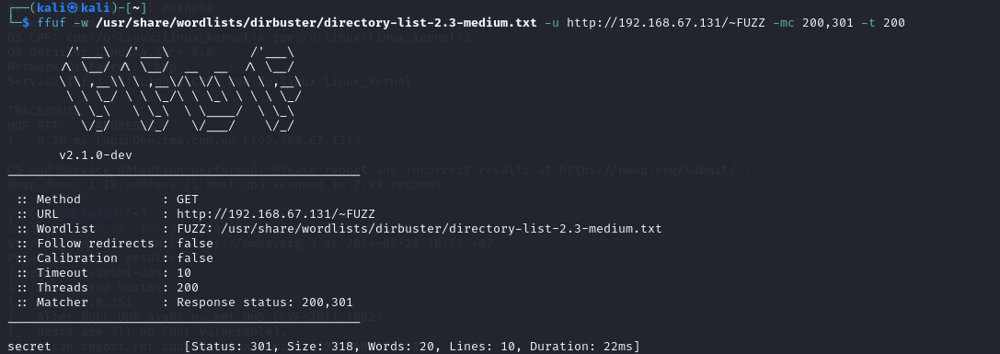
- Thấy có `secret` file

- Tiếp tục tìm kiếm private key với fuzz, note là ssh username = icex64, dùng ffuf thì ko thấy file nào xuất hiện.
- Do đó phải thay đổi cách tìm kiếm như trên (dùng ~), nhưng ở đây là file ẩn (hidden), mà trong linux, các file này thường sẽ có dấu `.` ở đầu file.

- Kết quả có file `.mysecret.txt`


- Nó được encode bởi Base`xx`, dùng https://www.dcode.fr/cipher-identifier để analyse
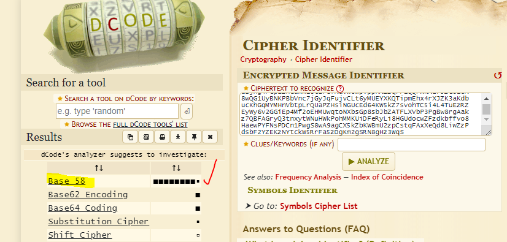
- Chuỗi này dùng Base58 để encode, ta dùng [CyberChef](https://gchq.github.io/CyberChef) để decode

- Great, nó là 1 file private ssh key, tải file này về với tên id_rsa

- Ah, ta cần 1 passphrase nữa. Trong pentest, ta thường dùng John the Ripper để crack password.
- Dùng ssh2john để convert private sang hash

- Dùng John để crack với fasttrack wordlist

- Check again, pass là `P@55w0rd!`

- Login thành công

- Cat user.txt
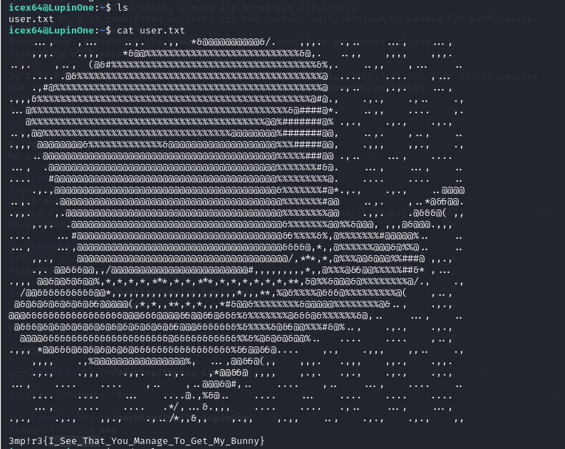

## Privilege Escalation
- Check `sudo -l` --> đây luôn là command check trước tiên khi login vào máy linux, vì nó chứa các thông tin của user hoặc root, file permission. 
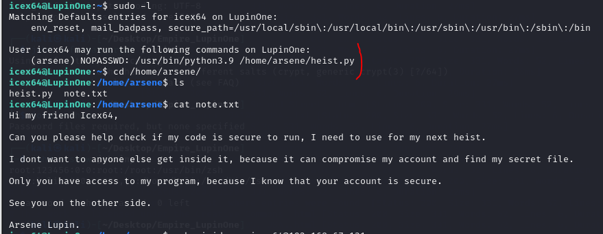
- Ta thấy user icex64 có thể run file heist.py as arsene user và nó nằm trong /home/arsene folder.
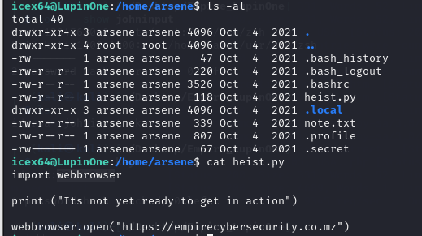
- Check nội dung thì thấy nó import 1 webbrowser library
- Locate và check permission lib này --> writeable bởi everyone --> tận dụng file này để conduct privilege escalation.

- Ta edit file với nano và include a Python reverse shell code (https://swisskyrepo.github.io/InternalAllTheThings/cheatsheets/shell-reverse-cheatsheet/#python) trong hàm open()
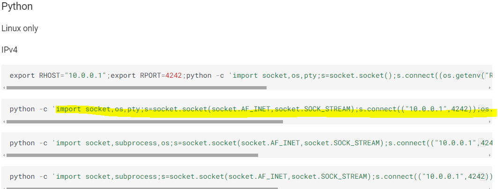

    
- Mở nc trên máy kali (attacker) để listen on port 9988 sau đó Run file trên target -> reverse shell is running.

- Do reverse shell nên nó (target: 67.131) sẽ tự connect back về attacker (Kali: 67.135), do đó trên máy kali , ta sẽ thấy

- Check 1 số file thì thấy có file .secret chứa password của arsene user.
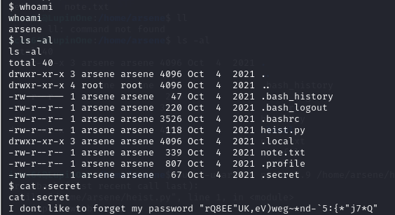
- Ở đây có 2 cách để tiếp tục exploit:
  - Cách 1: dùng password này để su từ icex64 qua arsene user.
  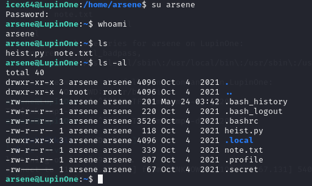
  - Check sudo -l
  
  - User arsene có thể run pip as root without needing a password, vào GTFObins (https://gtfobins.github.io/gtfobins/pip/#sudo) ta thấy rằng pip used as sudo có thể privilege escalation
  
  `````
    TF=$(mktemp -d)
    echo "import os; os.execl('/bin/sh', 'sh', '-c', 'sh <$(tty) >$(tty) 2>$(tty)')" > $TF/setup.py
    sudo pip install $TF
  `````
  - Và có thể escalate lên root :)
  
  - Từ đó có thể get file root.txt, đây là mục đích cuối cùng của bài này
  
  

- Cách 2: upgrade shell
  - Ở nc listening trên máy kali, dùng kĩ thuật upgrade shell trực tiếp trên terminal, ko cần phải su user như cách 1.
  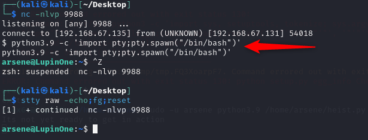
  - Lặp lại sudo -l và lợi dụng lỗ hổng của pip để run với root user.

### Cuối cùng đã done với Empire-Lupin One lab.